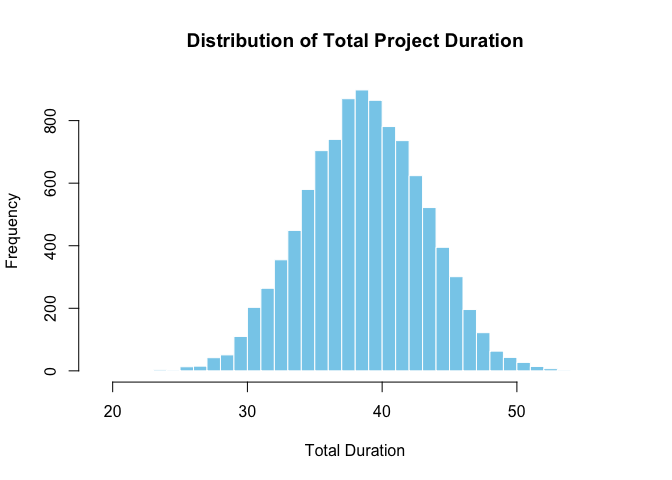

<!-- README.md is generated from README.Rmd. Please edit that file -->

# PRA


<!-- badges: start -->

[](https://lifecycle.r-lib.org/articles/stages.html#experimental)
[](https://CRAN.R-project.org/package=PRA)


[](https://zenodo.org/doi/10.5281/zenodo.12627130)
<!-- badges: end -->

Data Analysis for Project Risk Managment via the Second Moment Method
(SMM), Monte Carlo (MC) Simulation, Bayesian methods, Design Structure
Matrices (DSMs), and more.

## Installation

To install the release verion of PRA, use:

``` r
install_packages('PRA')
```

You can install the development version of PRA like so:

``` r
devtools::install_github('paulgovan/PRA')
```

## Usage

Here is a basic example which shows you how to solve a common problem
using Monte Carlo Simulation.

First, load the package:

``` r
library(PRA)
```

Next, set the number of simulations and describe probability distributions for 3 work packages:

```
num_simulations <- 10000
task_distributions <- list(
  list(type = "normal", mean = 10, sd = 2),  # Task A: Normal distribution
  list(type = "triangular", a = 5, b = 10, c = 15),  # Task B: Triangular distribution
  list(type = "uniform", min = 8, max = 12)  # Task C: Uniform distribution
)
```

Then, set the correlation matrix between the 3 work packages:

```
correlation_matrix <- matrix(c(
  1, 0.5, 0.3,
  0.5, 1, 0.4,
  0.3, 0.4, 1
), nrow = 3, byrow = TRUE)
```

Finally, run the simulation using the `mcs` function:

```
results <- mcs(num_simulations, task_distributions, correlation_matrix)
```

To calculate the mean of the total duration:

```
cat("Mean Total Duration:", results$total_mean, "\n")
#> Mean Total Duration: 38.6582
```

To calculate the variance of the total duration:

``` r
cat("Variance of Total Duration:", results$total_variance, "\n")
#> Variance of Total Duration: 19.92074
```

To build a histogram of the total duration:

``` r
hist(results$total_distribution, breaks = 50, main = "Distribution of Total Project Duration", 
     xlab = "Total Duration", col = "skyblue", border = "white")
```



## More Resources

Much of this package is based on the book [Data Analysis for Engineering
and Project Risk
Managment](https://www.amazon.com/dp/3030142531?ref=cm_sw_r_cp_ud_dp_AC0JN7RWC29CM028V2YZ&ref_=cm_sw_r_cp_ud_dp_AC0JN7RWC29CM028V2YZ&social_share=cm_sw_r_cp_ud_dp_AC0JN7RWC29CM028V2YZ)
by Ivan Damnjanovic and Ken Reinschmidt and comes highly recommended.

## Code of Conduct

Please note that the PRA project is released with a [Contributor Code of
Conduct](https://contributor-covenant.org/version/2/1/CODE_OF_CONDUCT.html).
By contributing to this project, you agree to abide by its terms.
