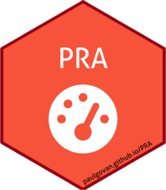
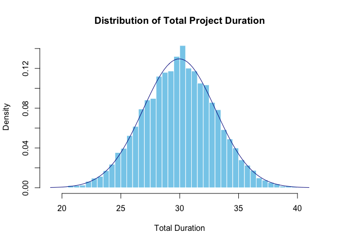

<!-- README.md is generated from README.Rmd. Please edit that file -->

# PRA <a href="https://paulgovan.github.io/PRA/"></a>

<!-- badges: start -->

[](https://www.repostatus.org/#active)
[](https://CRAN.R-project.org/package=PRA)
[](https://github.com/paulgovan/PRA/actions/workflows/R-CMD-check.yaml)
[](https://app.codecov.io/gh/paulgovan/PRA)
[](https://cran.r-project.org/package=PRA)
[](https://cran.r-project.org/package=PRA)
[](https://doi.org/10.32614/CRAN.package.PRA)
<!-- badges: end -->

## Introduction

Welcome to **PRA**! This project provides a set of tools for performing
Project Risk Analysis (PRA) using various quantitative methods. It is
designed to help project analysts assess and manage risks associated
with project schedules, costs, and performance.

## Key features:

- [Second Moment
  Analysis](https://paulgovan.github.io/PRA/articles/SMM.html)
- [Monte Carlo
  Simulation](https://paulgovan.github.io/PRA/articles/MCS.html)
- [Contingency
  Analysis](https://paulgovan.github.io/PRA/articles/MCS.html#contingency)
- [Sensitivity
  Analysis](https://paulgovan.github.io/PRA/articles/MCS.html#sensitivity)
- [Earned Value
  Management](https://paulgovan.github.io/PRA/articles/evm.html)
- [Learning
  Curves](https://paulgovan.github.io/PRA/articles/sigmoidal.html)
- [Bayesian
  Methods](https://paulgovan.github.io/PRA/articles/Bayes.html)

## Installation

To install the release verion of PRA, use:

``` r
install_packages('PRA')
```

You can install the development version of PRA like so:

``` r
devtools::install_github('paulgovan/PRA')
```

## Usage

Here is a simple example of how to use the package for a common PRA
task.

First, load the package:

``` r
library(PRA)
```

Suppose you have a simple project with 3 tasks (A, B, and C), but the
duration of each task is uncertain. You can describe the uncertainty of
each task using probability distributions and then run a Monte Carlo
Simulation (MCS) to estimate the overall project duration.

To do so, set the number of simulations and describe probability
distributions for each work package. In this case, run 10,000
simulations with the following distributions:

``` r
num_simulations <- 10000
task_distributions <- list(
  list(type = "normal", mean = 10, sd = 2), # Task A: Normal distribution
  list(type = "triangular", a = 5, b = 10, c = 15), # Task B: Triangular distribution
  list(type = "uniform", min = 8, max = 12) # Task C: Uniform distribution
)
```

Then run the simulation using the `mcs` function and store the results:

``` r
results <- mcs(num_simulations, task_distributions)
```

To visualize the results, you can create a histogram of the total
project duration. You can also overlay a normal distribution curve based
on the mean and standard deviation of the results:

``` r
hist(results$total_distribution,
  freq = FALSE, breaks = 50, main = "Distribution of Total Project Duration",
  xlab = "Total Duration", col = "skyblue", border = "white"
)
curve(dnorm(x, mean = results$total_mean, sd = results$total_sd), add = TRUE, col = "darkblue")
```



This will give you a visual representation of the uncertainty in the
total project duration based on the individual task distributions. On
average, the project is expected to take around 30 time units, but could
take as little as 20 or as much as 40 time units.

## More Resources

This project was inspired by the book [Data Analysis for Engineering and
Project Risk Managment](https://doi.org/10.1007/978-3-030-14251-3) by
Ivan Damnjanovic and Ken Reinschmidt and is highly recommended.

## Code of Conduct

Please note that the PRA project is released with a [Contributor Code of
Conduct](https://contributor-covenant.org/version/2/1/CODE_OF_CONDUCT.html).
By contributing to this project, you agree to abide by its terms.
