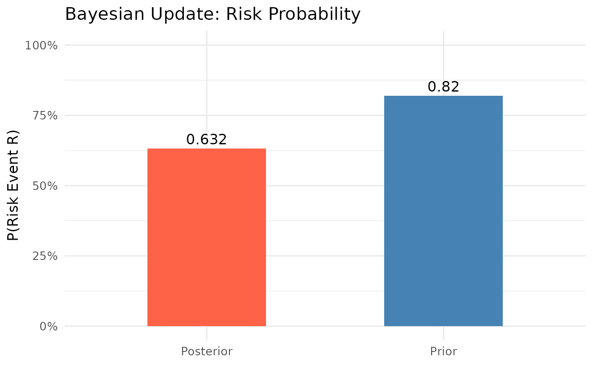
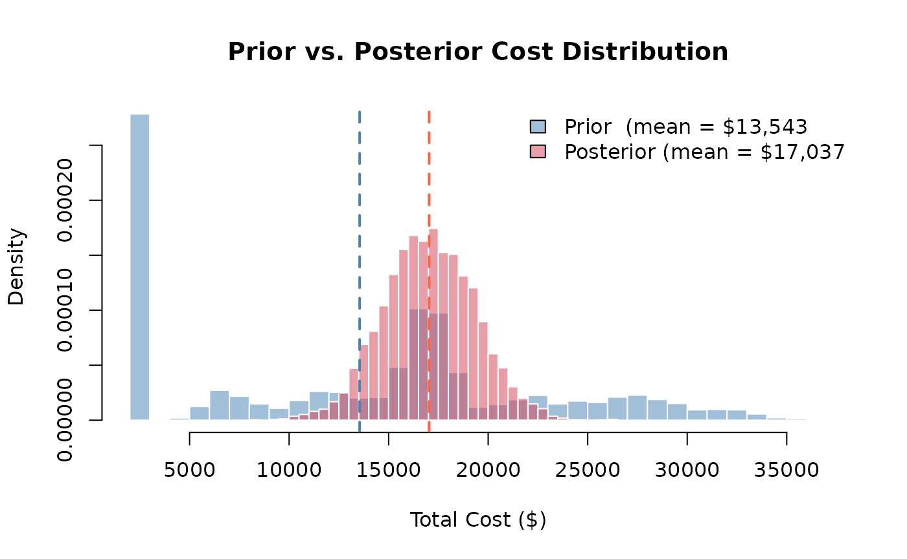

# Bayesian Methods

## Introduction

Bayesian inference provides a principled framework for updating beliefs
as new evidence arrives. In project risk management, this means starting
with prior estimates of risk probability (based on historical data or
expert judgment), then refining those estimates as on-site observations
accumulate.

Bayes’ theorem states:

$$P(H \mid E) = \frac{P(E \mid H) \cdot P(H)}{P(E)}$$

The PRA package provides four Bayesian functions organized into two
stages:

| Stage         | Function                                                                          | Purpose                                                         |
|---------------|-----------------------------------------------------------------------------------|-----------------------------------------------------------------|
| **Prior**     | [`risk_prob()`](https://paulgovan.github.io/PRA/reference/risk_prob.md)           | Compute risk probability from root causes (no observations yet) |
| **Prior**     | [`cost_pdf()`](https://paulgovan.github.io/PRA/reference/cost_pdf.md)             | Sample prior cost distribution based on risk probabilities      |
| **Posterior** | [`risk_post_prob()`](https://paulgovan.github.io/PRA/reference/risk_post_prob.md) | Update risk probability after observing cause status            |
| **Posterior** | [`cost_post_pdf()`](https://paulgovan.github.io/PRA/reference/cost_post_pdf.md)   | Sample posterior cost distribution based on observed risks      |

``` r
library(PRA)
```

## Step 1: Prior Risk Probability

Before any observations are made,
[`risk_prob()`](https://paulgovan.github.io/PRA/reference/risk_prob.md)
computes the probability of a risk event R occurring given two potential
root causes. For each cause, we supply:

- `cause_probs` — prior probability that the cause is present
- `risks_given_causes` — P(R \| cause present)
- `risks_given_not_causes` — P(R \| cause absent)

``` r
cause_probs <- c(0.3, 0.2)
risks_given_causes <- c(0.8, 0.6)
risks_given_not_causes <- c(0.2, 0.4)
```

``` r
prior_risk <- risk_prob(cause_probs, risks_given_causes, risks_given_not_causes)
cat("Prior probability of risk event R:", round(prior_risk, 3), "\n")
```

Prior probability of risk event R: 0.82

## Step 2: Prior Cost Distribution

Given the prior risk probabilities,
[`cost_pdf()`](https://paulgovan.github.io/PRA/reference/cost_pdf.md)
samples the cost distribution before any field observations. Three
independent risk events can each contribute cost if they occur.

``` r
risk_probs <- c(0.3, 0.5, 0.2)
means_given_risks <- c(10000, 15000, 5000)
sds_given_risks <- c(2000, 1000, 1000)
base_cost <- 2000
```

``` r
prior_samples <- cost_pdf(
  num_sims          = 5000,
  risk_probs        = risk_probs,
  means_given_risks = means_given_risks,
  sds_given_risks   = sds_given_risks,
  base_cost         = base_cost
)
```

We will compare this to the posterior distribution in Step 4.

## Step 3: Posterior Risk Probability (Bayesian Update)

After inspecting the project site, we observe that Cause 1 is present (=
1). Cause 2 has not yet been assessed (= NA).
[`risk_post_prob()`](https://paulgovan.github.io/PRA/reference/risk_post_prob.md)
updates the risk probability using only the available evidence — NA
causes are treated as unobserved and do not contribute to the update.

``` r
# C1 observed as present; C2 not yet assessed
observed_causes <- c(1, NA)
```

``` r
posterior_risk <- risk_post_prob(
  cause_probs, risks_given_causes,
  risks_given_not_causes, observed_causes
)
cat("Posterior probability of risk event R:", round(posterior_risk, 3), "\n")
```

Posterior probability of risk event R: 0.632

Observing Cause 1 (which has a strong link to R) raises the risk
probability substantially. The NA for Cause 2 is simply ignored — only
confirmed observations drive the update.

### Prior vs. Posterior Probability

``` r
prob_data <- data.frame(
  Stage       = c("Prior", "Posterior"),
  Probability = c(prior_risk, posterior_risk)
)

p <- ggplot2::ggplot(prob_data, ggplot2::aes(x = Stage, y = Probability, fill = Stage)) +
  ggplot2::geom_col(width = 0.5, show.legend = FALSE) +
  ggplot2::geom_text(ggplot2::aes(label = round(Probability, 3)),
    vjust = -0.4, size = 4.5
  ) +
  ggplot2::scale_fill_manual(values = c("Prior" = "steelblue", "Posterior" = "tomato")) +
  ggplot2::scale_y_continuous(limits = c(0, 1), labels = scales::percent) +
  ggplot2::labs(
    title = "Bayesian Update: Risk Probability",
    x     = NULL,
    y     = "P(Risk Event R)"
  ) +
  ggplot2::theme_minimal(base_size = 13)

print(p)
```



The bar chart makes the Bayesian update tangible: observing Cause 1
nearly doubles the estimated probability of the risk event.

## Step 4: Posterior Cost Distribution

Now that we know Cause 1 is present (Risk 1 occurs), and one risk
remains unobserved (Risk 2 = NA),
[`cost_post_pdf()`](https://paulgovan.github.io/PRA/reference/cost_post_pdf.md)
samples the posterior cost distribution. Observed risks that occurred
(= 1) add their cost; unobserved risks (= NA) are excluded from the
simulation.

``` r
observed_risks <- c(1, NA, 1) # Risk 1 and 3 confirmed; Risk 2 not yet assessed
```

``` r
posterior_samples <- cost_post_pdf(
  num_sims          = 5000,
  observed_risks    = observed_risks,
  means_given_risks = means_given_risks,
  sds_given_risks   = sds_given_risks,
  base_cost         = base_cost
)
```

### Prior vs. Posterior Cost Distribution

Plotting both distributions on the same axes shows how the evidence
shifts the cost estimate:

``` r
xlim_range <- range(c(prior_samples, posterior_samples))

# Prior cost histogram
hist(prior_samples,
  breaks = 40, freq = FALSE,
  col = rgb(0.27, 0.51, 0.71, 0.5), # steelblue, semi-transparent
  border = "white",
  xlim = xlim_range,
  main = "Prior vs. Posterior Cost Distribution",
  xlab = "Total Cost ($)",
  ylab = "Density"
)

# Posterior cost histogram (overlaid)
hist(posterior_samples,
  breaks = 40, freq = FALSE,
  col = rgb(0.84, 0.24, 0.31, 0.5), # tomato, semi-transparent
  border = "white",
  add = TRUE
)

abline(v = mean(prior_samples), col = "steelblue", lty = 2, lwd = 2)
abline(v = mean(posterior_samples), col = "tomato", lty = 2, lwd = 2)

legend("topright",
  legend = c(
    paste0("Prior  (mean = $", format(round(mean(prior_samples)), big.mark = ",")),
    paste0("Posterior (mean = $", format(round(mean(posterior_samples)), big.mark = ","))
  ),
  fill = c(rgb(0.27, 0.51, 0.71, 0.5), rgb(0.84, 0.24, 0.31, 0.5)),
  bty = "n"
)
```



**Interpretation:** The posterior distribution is narrower and shifted —
observing which risks materialized eliminates uncertainty about some
cost components. The remaining spread reflects uncertainty from
unobserved risks and cost variability in the confirmed risks.

## Summary

The Bayesian workflow in PRA follows a natural before-and-after
structure:

1.  **Before observations** — use
    [`risk_prob()`](https://paulgovan.github.io/PRA/reference/risk_prob.md)
    and
    [`cost_pdf()`](https://paulgovan.github.io/PRA/reference/cost_pdf.md)
    to characterize the risk landscape.
2.  **As evidence arrives** — use
    [`risk_post_prob()`](https://paulgovan.github.io/PRA/reference/risk_post_prob.md)
    and
    [`cost_post_pdf()`](https://paulgovan.github.io/PRA/reference/cost_post_pdf.md)
    to update estimates.
3.  **NA values** in `observed_causes` and `observed_risks` represent
    causes/risks that have not yet been assessed; they are correctly
    excluded from the Bayesian update.

This approach is particularly powerful in phased projects where
information about risk drivers becomes available progressively, allowing
cost forecasts to be refined at each stage.
