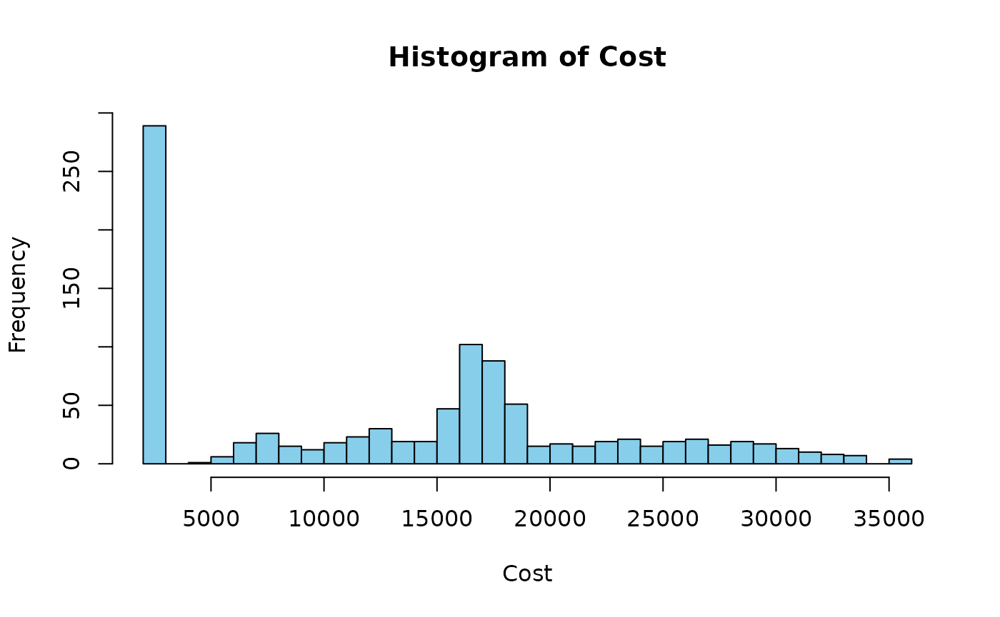

# Bayesian Methods

## Introduction

Bayesian inference is a statistical approach based on Bayes’ theorem,
which describes how to update beliefs based on new evidence. This
approach provides a framework for reasoning about probabilities in the
presence of uncertainty.

Bayes’ theorem states that:

$$P\left( H|E \right) = \frac{P\left( E|H \right)P(H)}{P(E)}$$

where:

- $P\left( H|E \right)$ is the posterior probability of hypothesis $H$
  given evidence $E$.
- $P\left( E|H \right)$ is the likelihood of observing evidence $E$
  given that hypothesis $H$ is true.
- $P(H)$ is the prior probability of hypothesis $H$ before observing
  evidence $E$.
- $P(E)$ is the probability of evidence $E$ occurring.

This document explores Bayesian methods for risk probability and cost
probability density estimation.

## Inference for Risk Probability

Consider a risk event $R$ that may be caused by multiple root causes
$C_{1},C_{2},\ldots,C_{n}$. The probability of $R$ occurring can be
computed as:

$$P(R) = \sum\limits_{i = 1}^{n}P\left( R|C_{i} \right)P\left( C_{i} \right) + P\left( R|\neg C_{i} \right)P\left( \neg C_{i} \right)$$

where:

- $P\left( R|C_{i} \right)$ represents the probability of $R$ occurring
  given that $C_{i}$ is present.
- $P\left( C_{i} \right)$ is the prior probability of the root cause
  $C_{i}$.
- $P\left( R|\neg C_{i} \right)$ is the probability of $R$ occurring
  when $C_{i}$ is absent.
- $P\left( \neg C_{i} \right) = 1 - P\left( C_{i} \right)$ is the
  probability that $C_{i}$ does not occur.

The function `risk_prob` calculates the probability of the risk event
given the root causes and their conditional probabilities.

### Example

First, load the package:

``` r
library(PRA)
#> Registered S3 method overwritten by 'PRA':
#>   method    from 
#>   print.nls stats
```

Suppose there are two root causes with probabilities
$P\left( C_{1} \right) = 0.3$ and $P\left( C_{2} \right) = 0.2$.

``` r
cause_probs <- c(0.3, 0.2)
```

The conditional probabilities of the risk event given each cause are
$P\left( R|C_{1} \right) = 0.8$ and $P\left( R|C_{2} \right) = 0.6$,
respectively. The conditional probabilities of the risk event given not
each cause are $P\left( R|\neg C_{1} \right) = 0.2$ and
$P\left( R|\neg C_{2} \right) = 0.4$.

``` r
risks_given_causes <- c(0.8, 0.6)
risks_given_not_causes <- c(0.2, 0.4)
```

To calculate the probability of the risk event, use the `risk_prob`
function:

``` r
risk_prob_value <- risk_prob(cause_probs, risks_given_causes, risks_given_not_causes)
cat(risk_prob_value)
```

0.82

### Inference for Cost Probability Density

The `cost_pdf` function uses Bayesian inference to model the probability
distribution of cost outcomes based on the occurrence of risk events. It
assumes that each risk event contributes to the total cost according to
a normal distribution, leading to a mixture model representation:

$$P(A) = \sum\limits_{i = 1}^{n}P\left( R_{i} \right) \cdot N\left( A|\mu_{i},\sigma_{i} \right) + P\left( \neg R_{i} \right) \cdot N\left( A|\text{base\_cost},0 \right)$$

where:

- $P\left( R_{i} \right)$ is the probability of risk event $R_{i}$.
- $N\left( A|\mu_{i},\sigma_{i} \right)$ is the normal distribution with
  mean $\mu_{i}$ and standard deviation $\sigma_{i}$.
- $P\left( \neg R_{i} \right) = 1 - P\left( R_{i} \right)$ is the
  probability that risk event $R_{i}$ does not occur.
- $N\left( A|\text{base\_cost},0 \right)$ is a point mass at the
  baseline cost $\text{base\_cost}$.

The function `cost_pdf` generates random samples from the mixture model
to estimate the cost distribution.

## Example

Suppose there are three risk events with probabilities
$P\left( R_{1} \right) = 0.3$, $P\left( R_{2} \right) = 0.5$, and
$P\left( R_{3} \right) = 0.2$.

``` r
risk_probs <- c(0.3, 0.5, 0.2)
```

The means and standard deviations of the normal distributions for cost
given each risk event are:

``` r
means_given_risks <- c(10000, 15000, 5000)
sds_given_risks <- c(2000, 1000, 1000)
```

The baseline cost is $\text{base\_cost} = 2000$.

``` r
base_cost <- 2000
```

To generate random samples from the cost distribution, use the
`cost_pdf` function:

``` r
num_sims <- 1000
samples <- cost_pdf(num_sims, risk_probs, means_given_risks, sds_given_risks, base_cost)
hist(samples, breaks = 30, col = "skyblue", main = "Histogram of Cost", xlab = "Cost")
```



The histogram above shows the distribution of cost outcomes based on the
risk events and their associated costs.

## Posterior Risk Probability

Bayesian updating is the process of updating prior beliefs given new
evidence. The risk_post_prob function calculates the posterior
probability of a risk event given observations of its root causes. This
is achieved by applying Bayes’ theorem to update the prior probabilities
of root causes based on the observed data.

### Example

Suppose there are two root causes with prior probabilities
$P\left( C_{1} \right) = 0.3$ and $P\left( C_{2} \right) = 0.2$.

``` r
cause_probs <- c(0.3, 0.2)
```

The conditional probabilities of the risk event given each cause are
$P\left( R|C_{1} \right) = 0.8$ and $P\left( R|C_{2} \right) = 0.6$,
respectively. The conditional probabilities of the risk event given not
each cause are $P\left( R|\neg C_{1} \right) = 0.2$ and
$P\left( R|\neg C_{2} \right) = 0.4$.

``` r
risks_given_causes <- c(0.8, 0.6)
risks_given_not_causes <- c(0.2, 0.4)
```

Suppose the observed root causes are $C_{1} = 1$ and
$C_{2} = \text{NA}$.

``` r
observed_causes <- c(1, NA)
```

To calculate the posterior probability of the risk event, use the
`risk_post_prob` function:

``` r
risk_post_prob <- risk_post_prob(
  cause_probs, risks_given_causes,
  risks_given_not_causes, observed_causes
)
cat(risk_post_prob)
```

0.6315789

The posterior probability of the risk event is updated based on the
observed root causes.

## Posterior Cost Probability Density

The `cost_post_pdf` function generates a posterior probability density
function (PDF) for costs, given observed risk events. This function
simulates random samples from a mixture model based on Bayesian updating
principles.

### Example

Suppose there are three risk events with observed values $R_{1} = 1$,
$R_{2} = \text{NA}$, and $R_{3} = 1$.

``` r
observed_risks <- c(1, NA, 1)
```

The means and standard deviations of the normal distributions for cost
given each risk event are:

``` r
means_given_risks <- c(10000, 15000, 5000)
sds_given_risks <- c(2000, 1000, 1000)
```

The baseline cost is $\text{base\_cost} = 2000$.

``` r
base_cost <- 2000
```

To generate random samples from the posterior cost distribution, use the
`cost_post_pdf` function:

``` r
num_sims <- 1000
posterior_samples <- cost_post_pdf(
  num_sims = num_sims,
  observed_risks = observed_risks,
  means_given_risks = means_given_risks,
  sds_given_risks = sds_given_risks,
  base_cost = base_cost
)

hist(posterior_samples, breaks = 30, col = "skyblue", main = "Posterior Cost PDF", xlab = "Cost")
```


The histogram above shows the posterior probability density function of
costs based on the observed risk events.

## Conclusion

Bayesian methods provide a powerful framework for updating beliefs and
making inferences based on observed data. By incorporating prior
knowledge and new evidence, these methods can help quantify uncertainty
and make informed decisions in a wide range of applications.
