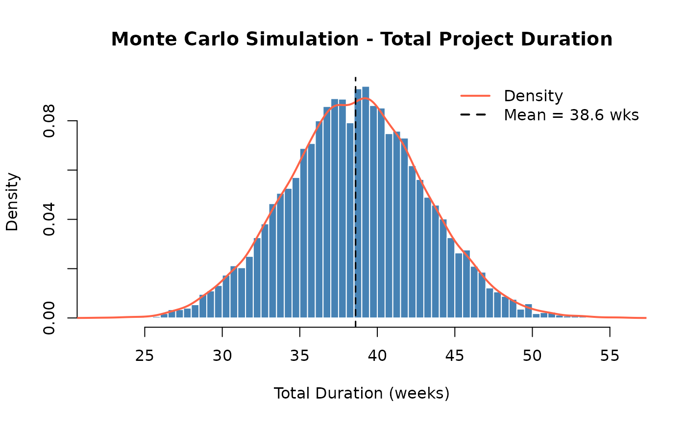
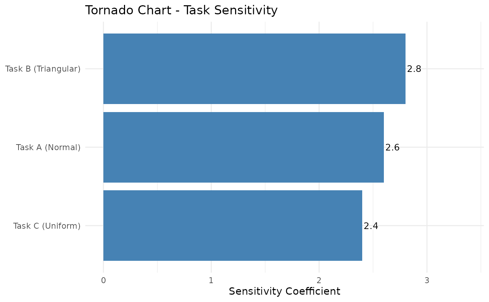

# Monte Carlo Simulation

Monte Carlo (MC) simulation is a quantitative risk analysis technique
that models uncertainty by running thousands of simulated project
outcomes. Instead of using single-point estimates for task durations or
costs, each task is described by a probability distribution. The
simulation draws random samples from these distributions, sums them to
get a total outcome, and repeats this thousands of times to build a full
picture of possible project results.

## Steps in MC Simulation

1.  **Model Definition** — Define project tasks and the variables that
    drive uncertainty (durations, costs).
2.  **Assign Distributions** — Choose a probability distribution for
    each uncertain variable (e.g., triangular for tasks with
    optimistic/likely/pessimistic estimates).
3.  **Specify Correlations** — If tasks are related (e.g., both affected
    by a shared risk), set a correlation coefficient between them.
4.  **Run Simulation** — Draw random samples and compute the total
    outcome for each iteration (typically 10,000+).
5.  **Analyze Results** — Summarize the distribution of totals using
    percentiles, mean, and variance.

## Example

``` r
library(PRA)
```

We model a 3-task project (in weeks). Task A follows a normal
distribution, Task B has a triangular distribution
(optimistic/most-likely/pessimistic), and Task C is uniformly
distributed.

``` r
num_simulations <- 10000
task_distributions <- list(
  list(type = "normal", mean = 10, sd = 2), # Task A
  list(type = "triangular", a = 5, b = 10, c = 15), # Task B
  list(type = "uniform", min = 8, max = 12) # Task C
)
```

### Correlation Matrix

Tasks often move together due to shared resources or external risks. The
correlation matrix captures this. Values range from −1 (perfectly
opposed) to +1 (perfectly aligned); 0 means independent. Here Tasks A
and B have moderate positive correlation (0.5), meaning delays in one
tend to coincide with delays in the other.

``` r
correlation_matrix <- matrix(c(
  1.0, 0.5, 0.3,
  0.5, 1.0, 0.4,
  0.3, 0.4, 1.0
), nrow = 3, byrow = TRUE)
```

### Run the Simulation

``` r
results <- mcs(num_simulations, task_distributions, correlation_matrix)
```

``` r
cat("Mean Total Duration:     ", round(results$total_mean, 2), "weeks\n")
```

Mean Total Duration: 38.6 weeks

``` r
cat("Variance of Duration:    ", round(results$total_variance, 2), "\n")
```

Variance of Duration: 20.01

``` r
cat("Std Dev of Duration:     ", round(results$total_sd, 2), "weeks\n")
```

Std Dev of Duration: 4.47 weeks

### Distribution of Outcomes

The histogram below shows all 10,000 simulated total durations. The
overlaid density curve reveals the shape of the distribution.

``` r
hist_data <- results$total_distribution

hist(hist_data,
  breaks = 50, freq = FALSE,
  main = "Monte Carlo Simulation - Total Project Duration",
  xlab = "Total Duration (weeks)", col = "steelblue", border = "white"
)
lines(density(hist_data), col = "tomato", lwd = 2)
abline(v = results$total_mean, col = "black", lty = 2, lwd = 1.5)
legend("topright",
  legend = c("Density", paste0("Mean = ", round(results$total_mean, 1), " wks")),
  col = c("tomato", "black"), lty = c(1, 2), lwd = 2, bty = "n"
)
```



## Interpreting Percentiles

The [`mcs()`](https://paulgovan.github.io/PRA/reference/mcs.md) function
returns key percentiles of the total distribution. These answer the
question: *“What duration has X% probability of not being exceeded?”*

``` r
knitr::kable(
  data.frame(
    Percentile = c("P5", "P50 (Median)", "P95"),
    Duration = round(results$percentiles, 1),
    Meaning = c(
      "5% chance of finishing this fast or faster",
      "Equal chance of finishing above or below this",
      "95% chance of finishing by this date"
    )
  ),
  caption = "Simulation Percentiles"
)
```

|     | Percentile   | Duration | Meaning                                       |
|:----|:-------------|---------:|:----------------------------------------------|
| 5%  | P5           |     31.2 | 5% chance of finishing this fast or faster    |
| 50% | P50 (Median) |     38.6 | Equal chance of finishing above or below this |
| 95% | P95          |     46.0 | 95% chance of finishing by this date          |

Simulation Percentiles

## Contingency Analysis

Contingency is the buffer added above the base estimate to cover
uncertainty. A common approach is to use the difference between the P95
(or chosen confidence level) outcome and the P50 (base estimate).

``` r
contingency_val <- contingency(results, phigh = 0.95, pbase = 0.50)
cat("Schedule contingency (P95 − P50):", round(contingency_val, 2), "weeks\n")
```

Schedule contingency (P95 − P50): 7.4 weeks

``` r
cat(
  "There is a 95% chance the project will finish within",
  round(results$percentiles["95%"], 1), "weeks.\n"
)
```

There is a 95% chance the project will finish within 46 weeks.

**Interpretation:** Adding 7.4 weeks of schedule contingency to the P50
estimate gives a 95% confidence of on-time delivery. Teams with low risk
tolerance should use P95; those with higher tolerance might use P80.

## Sensitivity Analysis

Sensitivity analysis identifies which tasks drive the most variability
in the total outcome — the tasks that deserve the most management
attention.

``` r
sensitivity_results <- sensitivity(task_distributions, correlation_matrix)

sens_data <- data.frame(
  Task        = c("Task A (Normal)", "Task B (Triangular)", "Task C (Uniform)"),
  Sensitivity = sensitivity_results
)

p <- ggplot2::ggplot(
  sens_data,
  ggplot2::aes(x = Sensitivity, y = reorder(Task, Sensitivity))
) +
  ggplot2::geom_col(fill = "steelblue") +
  ggplot2::geom_text(ggplot2::aes(label = round(Sensitivity, 3)),
    hjust = -0.1, size = 3.5
  ) +
  ggplot2::labs(
    title = "Tornado Chart - Task Sensitivity",
    x     = "Sensitivity Coefficient",
    y     = NULL
  ) +
  ggplot2::xlim(0, max(sensitivity_results) * 1.2) +
  ggplot2::theme_minimal()

print(p)
```



**Interpretation:** Tasks with larger bars contribute more variance to
the total. Prioritize risk mitigation efforts on the highest-sensitivity
task. Even a small reduction in its uncertainty can meaningfully reduce
overall project risk.
