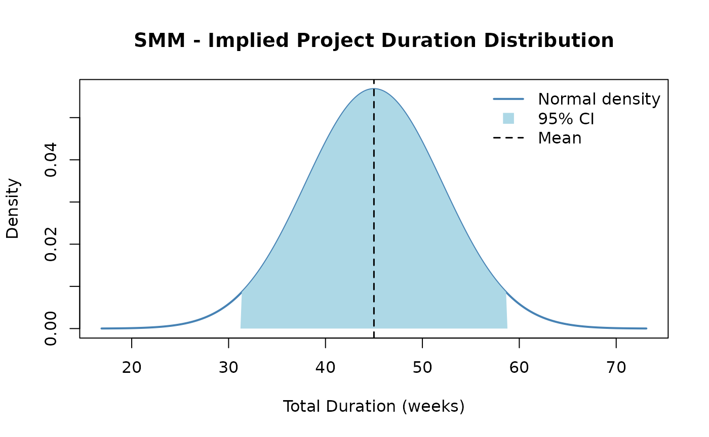

# Second Moment Method

The Second Moment Method (SMM) is a fast, analytical alternative to
Monte Carlo simulation for estimating project cost or schedule
uncertainty. Rather than running thousands of iterations, SMM propagates
uncertainty through a project mathematically using only the mean and
variance of each task — the “first two moments” of the probability
distribution.

## When to Use SMM

SMM is best suited for early-stage estimates when:

- Speed matters and simulation run-time is a concern
- You have credible mean and variance estimates for each task
- Tasks are approximately independent or have well-characterized
  correlations
- You need a quick sensitivity check before committing to a full Monte
  Carlo run

## Method Overview

For a project with *n* tasks, SMM computes:

- **Total mean:** Sum of individual task means:
  $E\lbrack X\rbrack = \sum_{i = 1}^{n}E\left\lbrack X_{i} \right\rbrack$
- **Total variance:** Sum of variances plus twice the sum of all
  pairwise covariances:
  $$Var(X) = \sum\limits_{i = 1}^{n}Var\left( X_{i} \right) + 2\sum\limits_{i < j}Cov\left( X_{i},X_{j} \right)$$
- **Covariance:** Derived from the correlation matrix:
  $Cov\left( X_{i},X_{j} \right) = \rho_{ij} \cdot \sigma_{i} \cdot \sigma_{j}$

## Example

``` r
library(PRA)
```

We analyze a 3-task project with task durations in weeks. Each task has
a known mean and variance, and correlations between tasks are provided.

``` r
task_means <- c(10, 15, 20) # Expected duration for each task (weeks)
task_vars <- c(4, 9, 16) # Variance of each task duration
cor_mat <- matrix(c(
  1.0, 0.5, 0.3,
  0.5, 1.0, 0.4,
  0.3, 0.4, 1.0
), nrow = 3, byrow = TRUE)
```

``` r
result <- smm(task_means, task_vars, cor_mat)
cat("Total Mean Duration:    ", round(result$total_mean, 2), "weeks\n")
```

Total Mean Duration: 45 weeks

``` r
cat("Total Variance:         ", round(result$total_var, 2), "\n")
```

Total Variance: 49.4

``` r
cat("Total Std Deviation:    ", round(result$total_std, 2), "weeks\n")
```

Total Std Deviation: 7.03 weeks

## Implied Distribution and Confidence Interval

SMM assumes the total project duration is approximately normally
distributed. This allows us to construct a confidence interval directly
from the mean and standard deviation.

A 95% confidence interval for total project duration is approximately:

$$\bar{X} \pm 1.96 \cdot \sigma$$

``` r
total_mean <- result$total_mean
total_sd <- result$total_std
ci_lower <- total_mean - 1.96 * total_sd
ci_upper <- total_mean + 1.96 * total_sd
cat("95% CI: [", round(ci_lower, 1), ",", round(ci_upper, 1), "] weeks\n")
```

95% CI: \[ 31.2 , 58.8 \] weeks

The plot below shows the implied normal distribution of total project
duration:

``` r
x_range <- seq(total_mean - 4 * total_sd, total_mean + 4 * total_sd, length.out = 300)
y_range <- dnorm(x_range, mean = total_mean, sd = total_sd)

plot(x_range, y_range,
  type = "l", lwd = 2, col = "steelblue",
  main = "SMM - Implied Project Duration Distribution",
  xlab = "Total Duration (weeks)", ylab = "Density"
)

# Shade 95% CI region
x_ci <- x_range[x_range >= ci_lower & x_range <= ci_upper]
y_ci <- dnorm(x_ci, mean = total_mean, sd = total_sd)
polygon(c(ci_lower, x_ci, ci_upper), c(0, y_ci, 0),
  col = "lightblue", border = NA
)

abline(v = total_mean, col = "black", lty = 2, lwd = 1.5)
legend("topright",
  legend = c("Normal density", "95% CI", "Mean"),
  col = c("steelblue", "lightblue", "black"),
  lty = c(1, NA, 2), lwd = c(2, NA, 1.5),
  pch = c(NA, 15, NA), pt.cex = 1.5,
  bty = "n"
)
```



## Comparison with Monte Carlo Simulation

Running Monte Carlo simulation with the same task distributions (and no
correlation, for a clean comparison) validates the SMM mean. The two
methods should yield very similar total means; differences in variance
arise because SMM and MCS handle correlated sampling differently.

``` r
# Represent each task as a normal distribution for MCS comparison (independent case)
task_dists_for_mcs <- list(
  list(type = "normal", mean = task_means[1], sd = sqrt(task_vars[1])),
  list(type = "normal", mean = task_means[2], sd = sqrt(task_vars[2])),
  list(type = "normal", mean = task_means[3], sd = sqrt(task_vars[3]))
)

# Run MCS without correlation (identity = fully independent)
mcs_result <- mcs(10000, task_dists_for_mcs)
```

``` r
# SMM variance without correlation = sum of individual variances
smm_var_nocor <- sum(task_vars)

comparison <- data.frame(
  Method          = c("SMM (independent)", "Monte Carlo (10,000 runs)"),
  Total_Mean      = round(c(result$total_mean, mcs_result$total_mean), 2),
  Total_Variance  = round(c(smm_var_nocor, mcs_result$total_variance), 2),
  Total_StdDev    = round(c(sqrt(smm_var_nocor), mcs_result$total_sd), 2)
)
knitr::kable(comparison, caption = "SMM vs. Monte Carlo Comparison (independent tasks)")
```

| Method                    | Total_Mean | Total_Variance | Total_StdDev |
|:--------------------------|-----------:|---------------:|-------------:|
| SMM (independent)         |      45.00 |          29.00 |         5.39 |
| Monte Carlo (10,000 runs) |      45.01 |          29.83 |         5.46 |

SMM vs. Monte Carlo Comparison (independent tasks)

The two methods agree closely on the mean and variance. SMM is faster
but assumes normality; Monte Carlo is more flexible and can use any
distribution type. When tasks are correlated, SMM adds covariance terms
analytically while MCS uses a correlation-based sampling scheme.

## Benefits and Limitations

|                             | SMM                               | Monte Carlo                              |
|-----------------------------|-----------------------------------|------------------------------------------|
| **Speed**                   | Instant (analytical)              | Slow (thousands of iterations)           |
| **Inputs needed**           | Mean + variance per task          | Full distribution per task               |
| **Distribution assumption** | Normal (by Central Limit Theorem) | Any distribution                         |
| **Correlation handling**    | Explicit covariance formula       | Cholesky decomposition                   |
| **Skewness / tails**        | Ignored                           | Captured accurately                      |
| **Best for**                | Early estimates, quick checks     | Detailed risk analysis, non-normal tasks |
