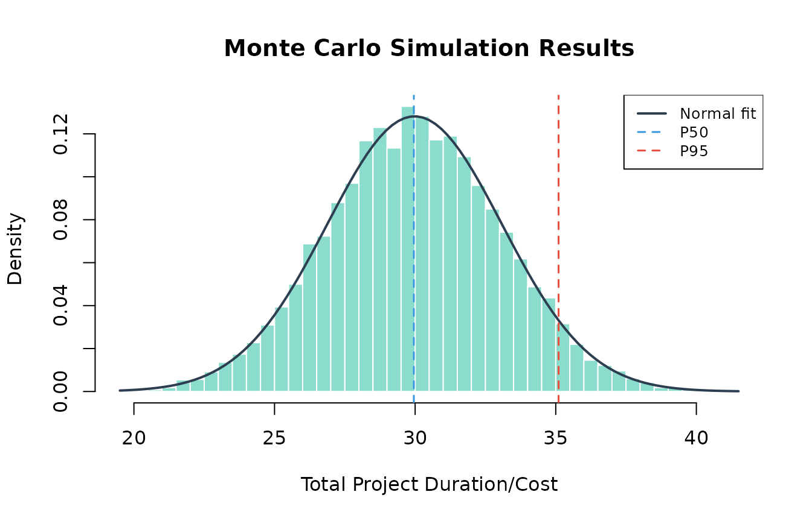
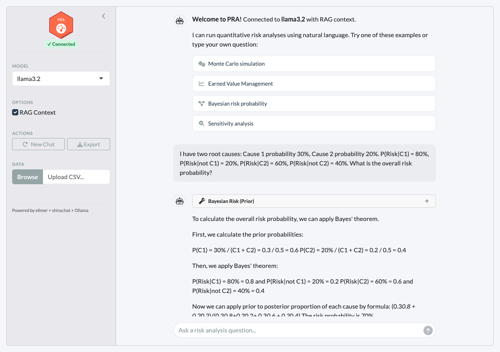

# Agentic Risk Analysis

## Overview

PRA includes an AI agent framework with three routing modes for user
input:

| Input type                        | Route                                                          | Example                           |
|-----------------------------------|----------------------------------------------------------------|-----------------------------------|
| `/command`                        | **Deterministic** — executes the tool directly, no LLM         | `/mcs tasks=[...]`                |
| Numerical data for computation    | **LLM tool call** — the model selects and calls the right tool | “Simulate 3 tasks: Normal(10,2)…” |
| Conceptual / explanatory question | **RAG** — answered from the knowledge base, no tool call       | “What is earned value?”           |

Three interfaces are available:

1.  **Slash commands** (`/mcs`, `/evm`, `/risk`, …) - deterministic tool
    calls that bypass the LLM for instant, reliable results
2.  **Chat interface**
    ([`pra_chat()`](https://paulgovan.github.io/PRA/reference/pra_chat.md)) -
    programmatic R chat object powered by ellmer where the LLM selects
    tools or answers from RAG
3.  **Shiny app**
    ([`pra_app()`](https://paulgovan.github.io/PRA/reference/pra_app.md)) -
    browser-based experience combining all three modes, powered by
    shinychat

## Prerequisites

### Install Ollama

Download from <https://ollama.com>, then pull a model:

``` bash
ollama serve
ollama pull llama3.2
ollama pull nomic-embed-text  # for RAG embeddings
```

### Install R dependencies

``` r
install.packages(c("ellmer", "ragnar", "shiny", "bslib", "shinychat", "jsonlite"))
```

## Slash Commands

Slash commands provide deterministic tool execution, no LLM required.
Type `/help` to see all available commands, or `/help <command>` for
detailed usage with argument descriptions and examples.

### Available commands

``` r
library(PRA)
cat(PRA:::format_help_overview())
```

### Getting help for a command

Each command includes argument specifications, defaults, and examples:

``` r
cat(PRA:::format_command_help("mcs", PRA:::pra_command_registry()$mcs))
```

### Example: Monte Carlo simulation

Run a simulation for a 3-task project directly:

``` r
set.seed(42)
r <- PRA:::execute_command(
  '/mcs n=10000 tasks=[{"type":"normal","mean":10,"sd":2},{"type":"triangular","a":5,"b":10,"c":15},{"type":"uniform","min":8,"max":12}]'
)
cat(r$result)
#> Monte Carlo Simulation Results (n = 10,000):
#> 
#> Summary Statistics:
#>   Mean  29.9804
#>   SD    3.113
#>   Min   19.502
#>   Max   41.3892
#> 
#> Percentiles:
#>   P5   24.8726
#>   P10  26.0194
#>   P25  27.8881
#>   P50  29.9536
#>   P75  32.0796
#>   P90  33.9873
#>   P95  35.1014
```

``` r
# The /mcs command stores results for chaining — visualize them:
result <- PRA:::.pra_agent_env$last_mcs
hist(result$total_distribution,
  freq = FALSE, breaks = 50,
  main = "Monte Carlo Simulation Results",
  xlab = "Total Project Duration/Cost",
  col = "#18bc9c80", border = "white"
)
curve(dnorm(x, mean = result$total_mean, sd = result$total_sd),
  add = TRUE, col = "#2c3e50", lwd = 2
)
abline(
  v = quantile(result$total_distribution, c(0.50, 0.95)),
  col = c("#3498db", "#e74c3c"), lty = 2, lwd = 1.5
)
legend("topright",
  legend = c("Normal fit", "P50", "P95"),
  col = c("#2c3e50", "#3498db", "#e74c3c"),
  lty = c(1, 2, 2), lwd = c(2, 1.5, 1.5),
  cex = 0.8, bg = "white"
)
```



### Example: Chaining MCS to contingency

After running `/mcs`, chain to `/contingency` for the reserve estimate:

``` r
r <- PRA:::execute_command("/contingency phigh=0.95 pbase=0.50")
cat(r$result)
#> Contingency Analysis:
#> 
#>   Base Percentile      P50
#>   High Percentile      P95
#>   Contingency Reserve  5.1478
```

### Example: Sensitivity analysis

Identify which tasks drive the most variance:

``` r
r <- PRA:::execute_command(
  '/sensitivity tasks=[{"type":"normal","mean":10,"sd":2},{"type":"triangular","a":5,"b":10,"c":15},{"type":"uniform","min":8,"max":12}]'
)
cat(r$result)
#> Sensitivity Analysis (variance contribution per task):
#> 
#>   Task 1    1
#>   Task 2    1
#>   Task 3    1
```

### Example: Earned Value Management

Full EVM analysis with a single command:

``` r
r <- PRA:::execute_command(
  "/evm bac=500000 schedule=[0.2,0.4,0.6,0.8,1.0] period=3 complete=0.35 costs=[90000,195000,310000]"
)
cat(r$result)
#> Earned Value Management Analysis:
#> 
#> Core Metrics:
#>   Planned Value (PV)  300,000
#>   Earned Value (EV)   175,000
#>   Actual Cost (AC)    310,000
#> 
#> Variances:
#>   Schedule Variance (SV)  -125,000
#>   Cost Variance (CV)      -135,000
#> 
#> Performance Indices:
#>   Schedule Performance Index (SPI)  0.5833
#>   Cost Performance Index (CPI)      0.5645
#> 
#> Forecasts:
#>   EAC (Typical)                 885,714.3
#>   EAC (Atypical)                635,000
#>   EAC (Combined)                1,296,939
#>   Estimate to Complete (ETC)    575,714.3
#>   Variance at Completion (VAC)  -385,714.3
#>   TCPI (to meet BAC)            1.7105
```

### Example: Bayesian risk probability

Calculate prior risk from two root causes:

``` r
r <- PRA:::execute_command(
  "/risk causes=[0.3,0.2] given=[0.8,0.6] not_given=[0.2,0.4]"
)
cat(r$result)
#> Bayesian Risk Analysis (Prior):
#> 
#>   Risk Probability  0.82
#>   Risk Percentage   82%
#>   Number of Causes  2
```

Then update with observations — Cause 1 occurred, Cause 2 unknown:

``` r
r <- PRA:::execute_command(
  "/risk_post causes=[0.3,0.2] given=[0.8,0.6] not_given=[0.2,0.4] observed=[1,null]"
)
cat(r$result)
#> Bayesian Risk Analysis (Posterior):
#> 
#>   Posterior Risk Probability  0.6316
#>   Posterior Risk Percentage   63.16%
#> 
#> Observations:
#>   Cause 1: Occurred
#>   Cause 2: Unknown
```

### Example: Second Moment Method

Quick analytical estimate without simulation:

``` r
r <- PRA:::execute_command("/smm means=[10,12,8] vars=[4,9,2]")
cat(r$result)
#> Second Moment Method Results:
#> 
#>   Total Mean      30
#>   Total Variance  15
#>   Total Std Dev   3.873
```

### Input validation and guidance

Missing or invalid arguments produce helpful error messages:

``` r
# Missing required arguments
r <- PRA:::execute_command("/risk causes=[0.3]")
cat(r$result)
#> **Missing required argument(s):** given, not_given
#> 
#> ### /risk — Bayesian Risk (Prior)
#> 
#> Calculate prior risk probability from root causes using Bayes' theorem.
#> 
#> **Arguments:**
#> - **causes** *(required)* — JSON array of cause probabilities, e.g. [0.3, 0.2]
#> - **given** *(required)* — JSON array of P(Risk | Cause), e.g. [0.8, 0.6]
#> - **not_given** *(required)* — JSON array of P(Risk | not Cause), e.g. [0.2, 0.4]
#> 
#> **Examples:**
#>   /risk causes=[0.3,0.2] given=[0.8,0.6] not_given=[0.2,0.4]
```

``` r
# Unknown command
r <- PRA:::execute_command("/simulate")
cat(r$result)
#> Unknown command: **/simulate**
#> 
#> Did you mean one of these?
#> - /mcs
#> - /smm
#> - /contingency
#> - /sensitivity
#> - /evm
#> - /risk
#> - /risk_post
#> - /learning
#> - /dsm
#> 
#> Type `/help` for a list of all commands.
```

## Chat Interface

The chat interface routes queries through the LLM, which decides whether
to call a tool or answer from RAG context:

- **Numerical data** (distributions, costs, schedules) → LLM calls the
  appropriate tool and interprets the results
- **Conceptual questions** (“what is CPI?”, “how does MCS work?”) → LLM
  answers from RAG knowledge base with source citations
- **Ambiguous** → LLM uses RAG context and only calls a tool if data is
  present

``` r
library(PRA)
chat <- pra_chat(model = "llama3.2")

# Tool call: user provides numerical data
chat$chat("Run a Monte Carlo simulation for a 3-task project with
  Task A ~ Normal(10, 2), Task B ~ Triangular(5, 10, 15),
  Task C ~ Uniform(8, 12). Use 10,000 simulations.")

# RAG: conceptual question, no computation needed
chat$chat("What is the difference between SPI and CPI?")
```

For guaranteed reliability with computations, use `/commands` instead.
The chat interface is best suited for exploratory questions and
interpretation.

### Using cloud models

For better accuracy with complex queries, supply a pre-configured ellmer
chat object:

``` r
# OpenAI
chat <- pra_chat(chat = ellmer::chat_openai(model = "gpt-4o"))

# Anthropic
chat <- pra_chat(chat = ellmer::chat_anthropic(model = "claude-sonnet-4-20250514"))
```

### Notes on chat reliability

- **Conceptual questions** work well even with small models since they
  only require reading RAG context, not tool calling.
- **Tool calling** quality depends on model size. `llama3.2` (3B)
  handles simple single-tool queries; larger models (8B+) are more
  reliable for multi-step chains.
- If the model attempts to call a tool for a conceptual question, or
  describes what it would do instead of calling tools, use `/commands`
  for deterministic results.

## Interactive Shiny App

For a browser-based experience with streaming responses and inline
visualizations:

``` r
pra_app()
```

The app supports all three input modes in the same chat panel:

- Type `/mcs tasks=[...]` for **instant deterministic** results
- Type “Simulate 3 tasks…” for **LLM tool calling**
- Type “What is earned value?” for **RAG-powered answers**


Clicking an example prompt executes the `/command` instantly and
displays rich results with tables and plots:



### Features

- **Three input modes** — `/commands` (deterministic), natural language
  (LLM tool calls), and conceptual questions (RAG)
- **Clickable example prompts** that execute `/commands` on click
- **Streaming chat** powered by shinychat with token-by-token responses
- **Inline tool results** displayed as rich HTML tables and plots
- **RAG source citations** — the agent cites knowledge base files for
  conceptual answers
- **Connection status** badge showing model connectivity
- **Collapsible sidebar** with model selection, RAG toggle, and CSV
  upload
- **Export** — download the conversation as a markdown file

### Configuration options

``` r
# Custom model and port
pra_app(model = "qwen2.5", port = 3838)

# Disable RAG for faster responses
pra_app(rag = FALSE)
```

## RAG Knowledge Base

The agent is enhanced with domain knowledge through retrieval-augmented
generation (RAG). When RAG context is retrieved, the agent cites the
source files in its response.

### Built-in knowledge files

| File                         | Topics                                                        |
|------------------------------|---------------------------------------------------------------|
| `mcs_methods.md`             | Distribution selection, correlation, interpreting percentiles |
| `evm_standards.md`           | EVM metrics, performance indices, forecasting methods         |
| `bayesian_risk.md`           | Prior/posterior risk, Bayes’ theorem for root cause analysis  |
| `learning_curves.md`         | Sigmoidal models (logistic, Gompertz, Pearl), curve fitting   |
| `sensitivity_contingency.md` | Variance decomposition, contingency reserves                  |
| `pra_functions.md`           | PRA package function reference                                |

### How RAG context flows

1.  User asks a question
2.  The question is embedded and matched against the knowledge base
    using hybrid search (vector similarity + BM25)
3.  The top 3 matching chunks are prepended to the query with
    `[Source: filename]` tags
4.  The agent is instructed to cite these sources in its response
5.  The agent uses the context to inform its answer while still calling
    tools for computation

### Adding your own documents

``` r
store <- build_knowledge_base()

# Add a single file
add_documents(store, "path/to/my_risk_register.md")

# Add all .md and .txt files in a directory
add_documents(store, "path/to/project_docs/")
```

### Disabling RAG

``` r
# Chat without RAG
chat <- pra_chat(model = "llama3.2", rag = FALSE)

# App without RAG
pra_app(rag = FALSE)
```

## Available Commands and Tools

### Slash commands (deterministic)

| Command        | Description                                    |
|----------------|------------------------------------------------|
| `/mcs`         | Monte Carlo simulation with task distributions |
| `/smm`         | Second Moment Method (analytical estimate)     |
| `/contingency` | Contingency reserve from last MCS              |
| `/sensitivity` | Variance contribution per task                 |
| `/evm`         | Full Earned Value Management analysis          |
| `/risk`        | Bayesian prior risk probability                |
| `/risk_post`   | Bayesian posterior risk after observations     |
| `/learning`    | Sigmoidal learning curve fit and prediction    |
| `/dsm`         | Design Structure Matrix                        |
| `/help`        | List all commands or get help for one          |

### LLM tools (via chat)

| Module     | Tool                             | Use case                            |
|------------|----------------------------------|-------------------------------------|
| Simulation | `mcs_tool`                       | Full Monte Carlo with distributions |
| Analytical | `smm_tool`                       | Quick mean/variance estimate        |
| Post-MCS   | `contingency_tool`               | Reserve at confidence level         |
| Post-MCS   | `sensitivity_tool`               | Variance contribution per task      |
| EVM        | `evm_analysis_tool`              | All 12 EVM metrics in one call      |
| Bayesian   | `risk_prob_tool`                 | Prior risk from root causes         |
| Bayesian   | `risk_post_prob_tool`            | Posterior risk after observations   |
| Bayesian   | `cost_pdf_tool`                  | Prior cost distribution             |
| Bayesian   | `cost_post_pdf_tool`             | Posterior cost distribution         |
| Learning   | `fit_and_predict_sigmoidal_tool` | Pearl/Gompertz/Logistic             |
| DSM        | `parent_dsm_tool`                | Resource-task dependencies          |
| DSM        | `grandparent_dsm_tool`           | Risk-resource-task dependencies     |

## Evaluation with vitals

PRA includes an evaluation framework for measuring LLM tool-calling
accuracy using the [vitals](https://vitals.tidyverse.org) package. The
evaluation suite in `inst/eval/pra_eval.R` tests 15 scenarios across
three tiers:

| Tier             | Description             | Example                                           |
|------------------|-------------------------|---------------------------------------------------|
| Single-tool      | One tool call           | “Simulate 3 tasks with distributions…”            |
| Multi-tool chain | Sequential tool calls   | “Run MCS then calculate contingency at 95%”       |
| Open-ended       | Requires interpretation | “My project is behind schedule, here’s EVM data…” |

``` r
# Run evaluation
source(system.file("eval/pra_eval.R", package = "PRA"))
results <- run_pra_eval(model = "llama3.2")

# Compare models
comparison <- run_pra_comparison(
  models = c("llama3.2", "qwen2.5"),
  rag_options = c(TRUE, FALSE)
)
```

## Troubleshooting

### Tool calling not working

Small models sometimes describe what they would do rather than actually
calling tools. Use `/commands` for reliable deterministic execution:

``` r
# Instead of asking the LLM:
chat$chat("Run a Monte Carlo simulation...")

# Use the /command directly in the app:
# /mcs tasks=[{"type":"normal","mean":10,"sd":2}]
```

Other workarounds for LLM chat:

- Use `llama3.1` (8B) or larger for better tool calling than 3B models
- Be explicit: “Call the mcs_tool with these parameters…”
- Use a cloud model:
  `pra_chat(chat = ellmer::chat_openai(model = "gpt-4o"))`

### Slow responses

- Use a smaller model (`llama3.2` is 3B, faster than `llama3.1` 8B)
- Ensure GPU acceleration is active (`ollama ps`)
- Disable RAG if not needed: `pra_chat(rag = FALSE)`
- Use `/commands` — they execute instantly without LLM overhead

### RAG build fails

``` r
install.packages("ragnar")
```

``` bash
ollama pull nomic-embed-text
```

### Source citations missing

If the agent does not cite sources in RAG-enabled responses, try:

- Using a larger model (8B+ models follow citation instructions more
  reliably)
- Being explicit: “Cite your sources in the response”
