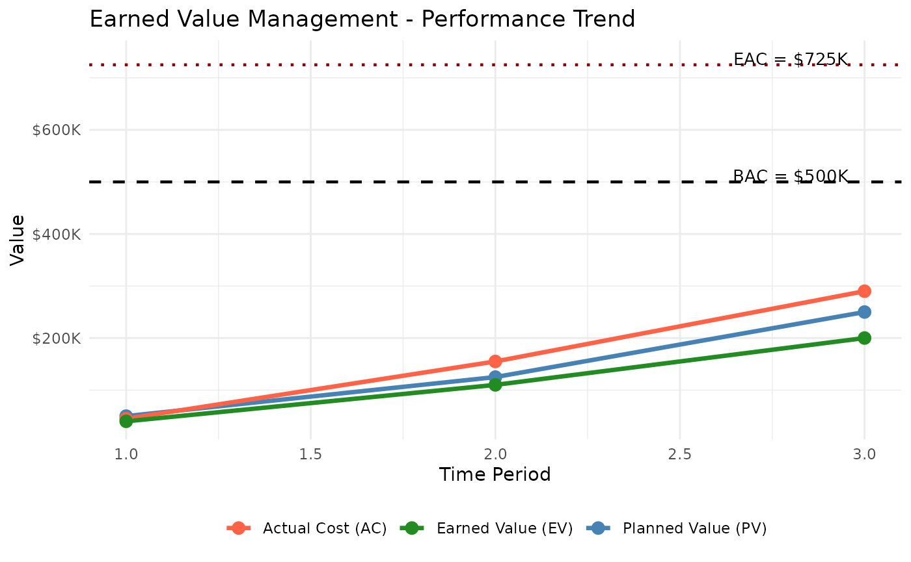

# Earned Value Management

Earned Value Management (EVM) is a project management technique that
integrates scope, schedule, and cost to measure project performance
objectively. By comparing planned work against actual work accomplished
and actual cost incurred, EVM provides early warning of cost overruns
and schedule delays.

## Key Metrics

| Metric                                   | Formula             | Interpretation                                           |
|------------------------------------------|---------------------|----------------------------------------------------------|
| **PV** – Planned Value                   | BAC × Planned%      | Budget authorized for scheduled work                     |
| **EV** – Earned Value                    | BAC × Actual%       | Budget for work actually completed                       |
| **AC** – Actual Cost                     | Σ period costs      | Total cost incurred to date                              |
| **CV** – Cost Variance                   | EV − AC             | \> 0: under budget; \< 0: over budget                    |
| **SV** – Schedule Variance               | EV − PV             | \> 0: ahead of schedule; \< 0: behind schedule           |
| **CPI** – Cost Performance Index         | EV / AC             | \> 1: efficient; = 1: on target; \< 1: inefficient       |
| **SPI** – Schedule Performance Index     | EV / PV             | \> 1: ahead; = 1: on target; \< 1: behind                |
| **EAC** – Estimate at Completion         | See below           | Forecast of total project cost                           |
| **ETC** – Estimate to Complete           | EAC − AC            | Remaining cost to finish the project                     |
| **VAC** – Variance at Completion         | BAC − EAC           | Expected budget surplus (positive) or overrun (negative) |
| **TCPI** – To-Complete Performance Index | (BAC−EV) / (BAC−AC) | Efficiency required on remaining work                    |

## Example Setup

``` r
library(PRA)
```

We will track a project with a total budget of \$500,000 over a 5-period
schedule.

``` r
bac <- 500000
schedule <- c(0.10, 0.25, 0.50, 0.75, 1.00)
time_period <- 3
```

### Planned Value (PV)

PV is the authorized budget for work planned through the current period.

``` r
pv_val <- pv(bac, schedule, time_period)
cat("Planned Value (PV): $", format(pv_val, big.mark = ","), "\n")
```

Planned Value (PV): \$ 250,000

The project was planned to be 50% complete by period 3, so PV =
\$250,000.

### Earned Value (EV)

EV reflects the budget value of work actually completed.

``` r
actual_per_complete <- 0.40
ev_val <- ev(bac, actual_per_complete)
cat("Earned Value (EV): $", format(ev_val, big.mark = ","), "\n")
```

Earned Value (EV): \$ 2e+05

Only 40% of work is done despite 50% being planned — we are behind
schedule.

### Actual Cost (AC)

AC is the cumulative cost incurred. Use `cumulative = FALSE` when
passing individual period costs.

``` r
period_costs <- c(45000, 110000, 135000)
ac_val <- ac(period_costs, time_period, cumulative = FALSE)
cat("Actual Cost (AC): $", format(ac_val, big.mark = ","), "\n")
```

Actual Cost (AC): \$ 290,000

### Performance Indicators

``` r
sv_val <- sv(ev_val, pv_val)
cv_val <- cv(ev_val, ac_val)
spi_val <- spi(ev_val, pv_val)
cpi_val <- cpi(ev_val, ac_val)

cat("Schedule Variance (SV):          $", format(sv_val, big.mark = ","), "\n")
```

Schedule Variance (SV): \$ -50,000

``` r
cat("Cost Variance (CV):              $", format(cv_val, big.mark = ","), "\n")
```

Cost Variance (CV): \$ -90,000

``` r
cat("Schedule Performance Index (SPI):", round(spi_val, 3), "\n")
```

Schedule Performance Index (SPI): 0.8

``` r
cat("Cost Performance Index (CPI):    ", round(cpi_val, 3), "\n")
```

Cost Performance Index (CPI): 0.69

**Interpretation:** SPI \< 1 means we are behind schedule (only earning
80 cents of planned value per dollar of schedule). CPI \< 1 means we are
over budget (earning only 69 cents of value per dollar spent).

## Forecasting: Estimate at Completion (EAC)

EAC forecasts the total cost at project completion. Three methods are
available, each making a different assumption about future performance:

| Method       | Formula                       | When to use                                                                 |
|--------------|-------------------------------|-----------------------------------------------------------------------------|
| **Typical**  | BAC / CPI                     | Current cost inefficiency is expected to continue                           |
| **Atypical** | AC + (BAC − EV)               | Cost overrun was a one-time event; future work will proceed at planned rate |
| **Combined** | AC + (BAC − EV) / (CPI × SPI) | Both cost and schedule performance will influence future costs              |

``` r
eac_typical <- eac(bac, method = "typical", cpi = cpi_val)
eac_atypical <- eac(bac, method = "atypical", ac = ac_val, ev = ev_val)
eac_combined <- eac(bac,
  method = "combined", cpi = cpi_val, ac = ac_val,
  ev = ev_val, spi = spi_val
)

cat("EAC (typical):  $", format(round(eac_typical), big.mark = ","), "\n")
```

EAC (typical): \$ 725,000

``` r
cat("EAC (atypical): $", format(round(eac_atypical), big.mark = ","), "\n")
```

EAC (atypical): \$ 590,000

``` r
cat("EAC (combined): $", format(round(eac_combined), big.mark = ","), "\n")
```

EAC (combined): \$ 833,750

The typical method gives the most conservative (highest cost) estimate
because it assumes the current CPI persists. The atypical method is the
most optimistic, assuming past overruns won’t recur.

### EAC Comparison Table

``` r
eac_table <- data.frame(
  Method = c("Typical", "Atypical", "Combined"),
  EAC = c(round(eac_typical), round(eac_atypical), round(eac_combined)),
  Overrun = c(
    round(eac_typical - bac),
    round(eac_atypical - bac),
    round(eac_combined - bac)
  ),
  Assumption = c(
    "Current CPI continues",
    "Future work at planned rate",
    "CPI and SPI both factor in"
  )
)
knitr::kable(eac_table,
  format.args = list(big.mark = ","),
  caption = "EAC Comparison by Method"
)
```

| Method   |     EAC | Overrun | Assumption                  |
|:---------|--------:|--------:|:----------------------------|
| Typical  | 725,000 | 225,000 | Current CPI continues       |
| Atypical | 590,000 |  90,000 | Future work at planned rate |
| Combined | 833,750 | 333,750 | CPI and SPI both factor in  |

EAC Comparison by Method

## Additional Metrics

``` r
etc_val <- etc(bac, ev_val, cpi_val)
vac_val <- vac(bac, eac_typical)

# TCPI to meet original BAC
tcpi_bac <- tcpi(bac, ev_val, ac_val, target = "bac")

# TCPI to meet revised EAC (typical)
tcpi_eac <- tcpi(bac, ev_val, ac_val, target = "eac", eac = eac_typical)

cat("Estimate to Complete (ETC):         $", format(round(etc_val), big.mark = ","), "\n")
```

Estimate to Complete (ETC): \$ 435,000

``` r
cat("Variance at Completion (VAC):       $", format(round(vac_val), big.mark = ","), "\n")
```

Variance at Completion (VAC): \$ -225,000

``` r
cat("TCPI (to meet BAC):                ", round(tcpi_bac, 3), "\n")
```

TCPI (to meet BAC): 1.429

``` r
cat("TCPI (to meet EAC):                ", round(tcpi_eac, 3), "\n")
```

TCPI (to meet EAC): 0.69

**Interpretation:** TCPI \> 1 means the team must work more efficiently
than they have been to meet the target. A TCPI of 1.43 to meet BAC means
the remaining work must be done at 143% efficiency — significantly
better than the current CPI of 0.69. Using the EAC target is more
realistic and shows whether the revised budget is achievable.

## Performance Trend Chart

The chart below shows cumulative PV, AC, and EV over time, with
horizontal reference lines for BAC and EAC.

``` r
time_periods <- c(1, 2, 3)
actual_pct <- c(0.08, 0.22, 0.40)
p_costs <- c(45000, 110000, 135000)

pv_vals <- sapply(time_periods, function(t) pv(bac, schedule, t))
ac_vals <- cumsum(p_costs)
ev_vals <- sapply(actual_pct, function(a) ev(bac, a))

trend_data <- data.frame(
  Period = time_periods,
  PV     = pv_vals,
  AC     = ac_vals,
  EV     = ev_vals
)

p <- ggplot2::ggplot(trend_data, ggplot2::aes(x = Period)) +
  ggplot2::geom_line(ggplot2::aes(y = PV, color = "Planned Value (PV)"), linewidth = 1.2) +
  ggplot2::geom_line(ggplot2::aes(y = AC, color = "Actual Cost (AC)"), linewidth = 1.2) +
  ggplot2::geom_line(ggplot2::aes(y = EV, color = "Earned Value (EV)"), linewidth = 1.2) +
  ggplot2::geom_point(ggplot2::aes(y = PV, color = "Planned Value (PV)"), size = 3) +
  ggplot2::geom_point(ggplot2::aes(y = AC, color = "Actual Cost (AC)"), size = 3) +
  ggplot2::geom_point(ggplot2::aes(y = EV, color = "Earned Value (EV)"), size = 3) +
  ggplot2::geom_hline(yintercept = bac, linetype = "dashed", color = "black", linewidth = 0.8) +
  ggplot2::geom_hline(yintercept = eac_typical, linetype = "dotted", color = "darkred", linewidth = 0.8) +
  ggplot2::annotate("text", x = 2.8, y = bac + 12000, label = "BAC = $500K", size = 3.5) +
  ggplot2::annotate("text", x = 2.8, y = eac_typical + 12000, label = "EAC = $725K", size = 3.5) +
  ggplot2::scale_color_manual(values = c(
    "Planned Value (PV)" = "steelblue",
    "Actual Cost (AC)"   = "tomato",
    "Earned Value (EV)"  = "forestgreen"
  )) +
  ggplot2::scale_y_continuous(labels = scales::label_dollar(scale = 1e-3, suffix = "K")) +
  ggplot2::labs(
    title  = "Earned Value Management - Performance Trend",
    x      = "Time Period",
    y      = "Value",
    color  = NULL
  ) +
  ggplot2::theme_minimal() +
  ggplot2::theme(legend.position = "bottom")

print(p)
```



**Reading the chart:** The gap between PV and EV (both measured on the
same vertical axis) shows the schedule gap — EV is below PV, confirming
we are behind. The gap between AC and EV shows the cost overrun — we
have spent more than the value we have earned.
