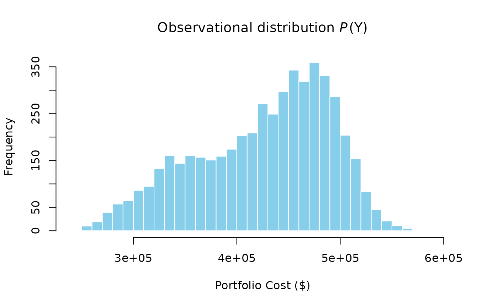
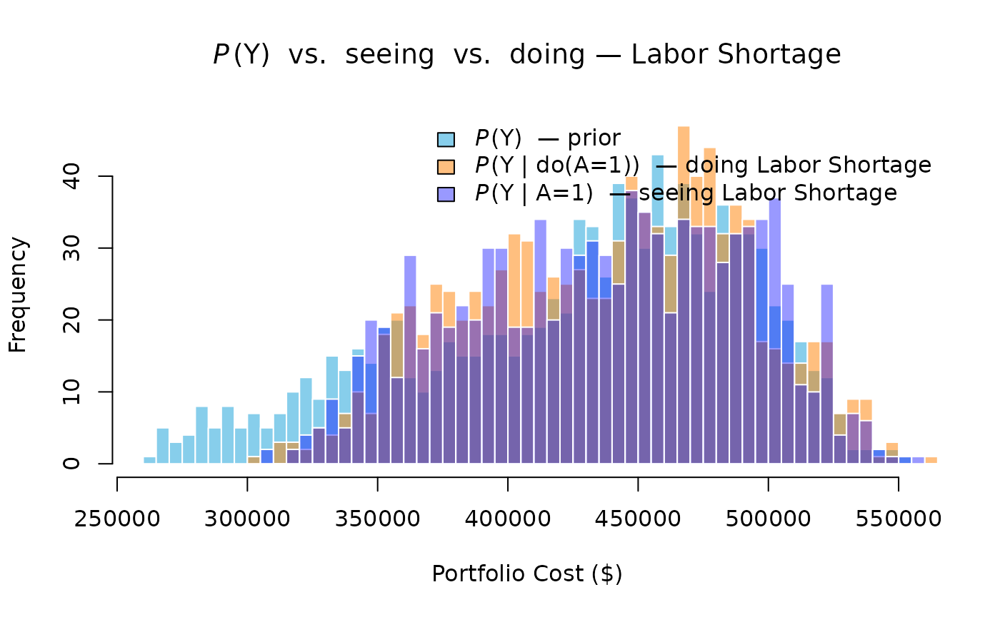
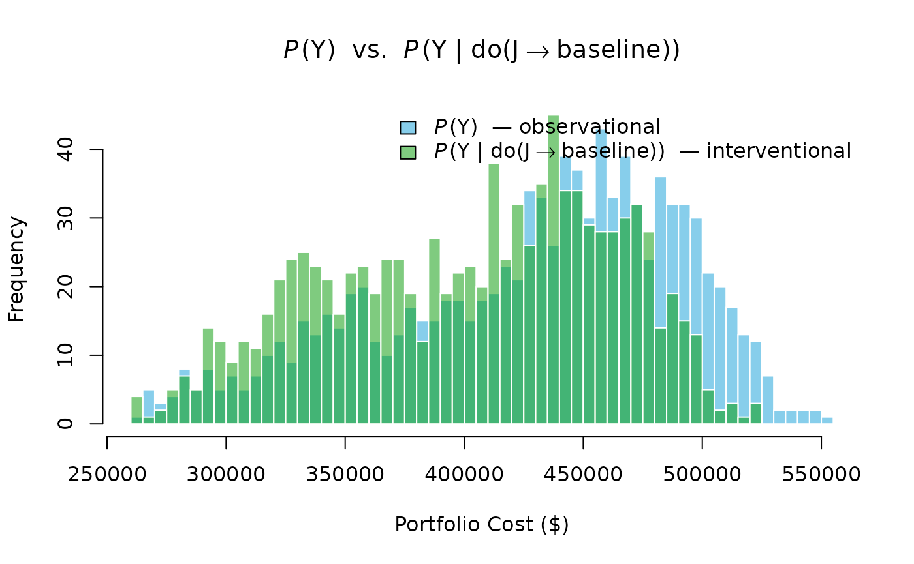
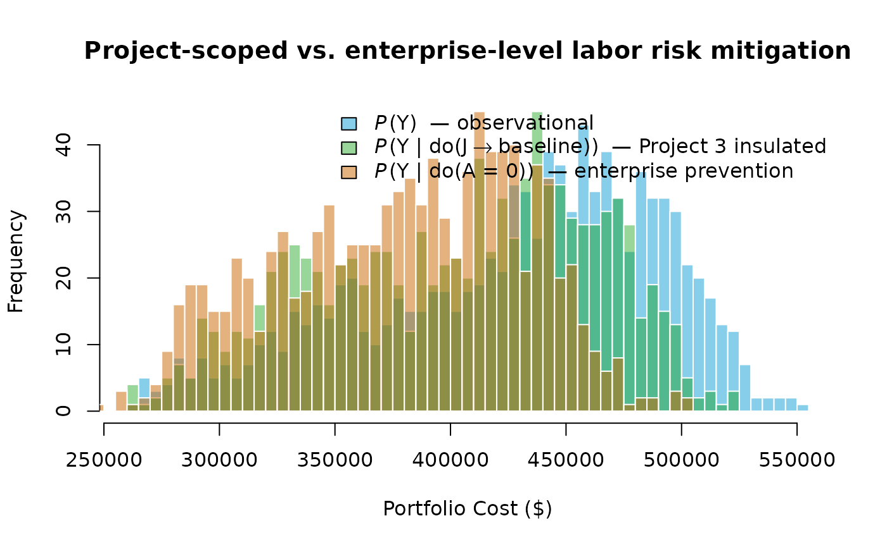
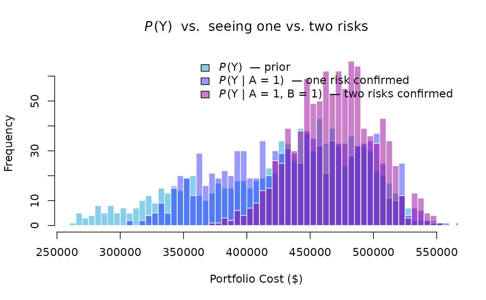

# Probabilistic Networks for Project Portfolio Risk Analysis

## Case Study

Consider an enterprise running three projects at the same time: a **Road
Repair**, a **Park Construction**, and a **Building Renovation**. Each
project has three tasks driven by three resources, labor, materials, and
equipment. Critically, these resources are shared at the enterprise
level: the same labor pool, the same material suppliers, and the same
equipment fleet serve all three projects.

This sharing creates direct portfolio-level risk. Three enterprise-wide
risk events, a **Labor Shortage**, a **Material Price Spike**, and a
**Weather Delay**, each propagate through the corresponding shared
resource to impact all three projects simultaneously. A single risk
event therefore inflates costs across the entire portfolio, not just one
project.

Critically, two of these risks, the Labor Shortage and the Material
Price Spike, share a common upstream driver: a **Supply Chain
Disruption** that simultaneously tightens the labor market and raises
commodity prices. This upstream dependence means that observing a Labor
Shortage is Bayesian evidence that a Supply Chain Disruption is
underway, which in turn raises the probability of a Material Price
Spike. It is precisely this structure, a root cause fanning out to
multiple risks, which fan out to shared resources, that makes the
distinction between *seeing* and *doing* empirically consequential at
the portfolio level.

## Tasks

The primary tasks for each project are as follows.

| ID  | Label    | Task             | Project_ID |
|:----|:---------|:-----------------|:-----------|
| M   | Task-1.1 | Site Preparation | V          |
| N   | Task-1.2 | Road Paving      | V          |
| O   | Task-1.3 | Final Inspection | V          |

Project 1: Road Repair Tasks {.table}

| ID  | Label    | Task                     | Project_ID |
|:----|:---------|:-------------------------|:-----------|
| P   | Task-2.1 | Site Preparation         | W          |
| Q   | Task-2.2 | Planting and Landscaping | W          |
| R   | Task-2.3 | Final Inspection         | W          |

Project 2: Park Construction Tasks {.table}

| ID  | Label    | Task                     | Project_ID |
|:----|:---------|:-------------------------|:-----------|
| S   | Task-3.1 | Demolition               | X          |
| T   | Task-3.2 | Renovation and Build-Out | X          |
| U   | Task-3.3 | Final Inspection         | X          |

Project 3: Building Renovation Tasks {.table}

## Resources

Each task is driven by one primary resource. Because all three projects
draw from the same enterprise-wide labor pool, supplier network, and
equipment fleet, the resource costs for like resources are correlated
across projects.

| ID  | Label        | Resource  | Task_ID | Task             |  Mean |   SD |
|:----|:-------------|:----------|:--------|:-----------------|------:|-----:|
| D   | Resource-1.1 | Labor     | M       | Site Preparation | 30000 | 5000 |
| E   | Resource-1.2 | Materials | N       | Road Paving      | 50000 | 8000 |
| F   | Resource-1.3 | Equipment | O       | Final Inspection | 20000 | 4000 |

Project 1: Road Repair Resources {.table}

| ID  | Label        | Resource  | Task_ID | Task                     |  Mean |   SD |
|:----|:-------------|:----------|:--------|:-------------------------|------:|-----:|
| G   | Resource-2.1 | Labor     | P       | Site Preparation         | 25000 | 4000 |
| H   | Resource-2.2 | Materials | Q       | Planting and Landscaping | 30000 | 5000 |
| I   | Resource-2.3 | Equipment | R       | Final Inspection         | 15000 | 3000 |

Project 2: Park Construction Resources {.table}

| ID  | Label        | Resource  | Task_ID | Task                     |  Mean |    SD |
|:----|:-------------|:----------|:--------|:-------------------------|------:|------:|
| J   | Resource-3.1 | Labor     | S       | Demolition               | 40000 |  6000 |
| K   | Resource-3.2 | Materials | T       | Renovation and Build-Out | 60000 | 10000 |
| L   | Resource-3.3 | Equipment | U       | Final Inspection         | 25000 |  4000 |

Project 3: Building Renovation Resources {.table}

## Risks

The network includes one root cause and three risk events. The root
cause (SC) is a Supply Chain Disruption that drives both the Labor
Shortage and the Material Price Spike. The Weather Delay is independent
of SC. Each risk event is enterprise-wide and impacts the corresponding
shared resource across all three projects.

| ID | Name | Event | P_occurs | Children |
|:---|:---|:---|---:|:---|
| SC | Root Cause | Supply Chain Disruption | 0.7 | A (Labor Shortage), B (Material Price Spike) |

Root Cause node (SC) {.table}

| Risk_ID | Name | Risk | Parent | P_given_SC1 | P_given_SC0 | P_marginal | Resource_Impacted |
|:---|:---|:---|:---|:---|:---|:---|:---|
| A | Risk-1 | Labor Shortage | SC | 0.95 | 0.4 | ≈ 0.79 | Labor (D, G, J) |
| B | Risk-2 | Material Price Spike | SC | 0.85 | 0.25 | ≈ 0.67 | Materials (E, H, K) |
| C | Risk-3 | Weather Delay | — | — | — | 0.60 | Equipment (F, I, L) |

Enterprise-Wide Risk nodes (A, B conditional on SC; C independent)
{.table}

The shared root cause SC is what makes seeing and doing diverge at the
risk level: observing $`A = 1`$ raises the posterior probability of SC,
which in turn raises the probability of $`B = 1`$ — a side-effect that a
causal intervention $`\operatorname{do}(A = 1)`$ does not produce,
because graph surgery severs SC’s influence on A without updating
beliefs about SC itself.

## Mathematical Formulation

The probabilistic network is a directed acyclic graph (DAG) whose
structure is encoded in an adjacency matrix **A** (Govan, 2014, Ch. IV):

``` math
\mathbf{A}_{ij} = 1 \quad \text{if node } i \text{ is conditionally dependent on node } j, \quad 0 \text{ otherwise.}
```

**A** is lower-triangular of size $`n_p \times n_p`$, where $`n_p = 26`$
is the total number of nodes. The layers of the network — root cause
**sc**, risks **r**, resources **a**, tasks **t**, projects, and
portfolio — appear in topological order along both axes, so that every
arc runs strictly from a lower-indexed parent to a higher-indexed child.
This structure guarantees that the graph is acyclic and that probability
distributions can be evaluated by a single forward pass in topological
order.

### Probability Distributions

The root cause SC has a marginal Bernoulli prior with
$`P(\text{SC} = 1) = 0.7`$. Risks A and B are conditionally dependent on
SC; C is independent. The joint distribution of the root cause and the
three enterprise risks is:

``` math
P(\text{SC},\, A,\, B,\, C) \;=\; P(\text{SC})\cdot P(A \mid \text{SC})\cdot P(B \mid \text{SC})\cdot P(C)
```

where $`P(A = 1 \mid \text{SC} = 1) = 0.95`$,
$`P(A = 1 \mid \text{SC} = 0) = 0.40`$, giving marginal
$`P(A = 1) \approx 0.79`$; $`P(B = 1 \mid \text{SC} = 1) = 0.85`$,
$`P(B = 1 \mid \text{SC} = 0) = 0.25`$, giving marginal
$`P(B = 1) \approx 0.67`$; and $`P(C = 1) = 0.6`$ marginally.

Each resource cost $`a_j`$ is conditionally dependent on its parent risk
$`r(\mathbf{a}_j)`$:

``` math
P(\mathbf{a}) = \prod_{j=1}^{9} P\!\left(a_j \mid r(a_j)\right)
```

For example, Labor-1 (node D) is distributed as:

``` math
P(D \mid A) = \begin{cases} \mathcal{N}(50{,}000,\; 8{,}000) & \text{if } A = 1 \text{ (Labor Shortage occurs)} \\ \mathcal{N}(30{,}000,\; 5{,}000) & \text{if } A = 0 \end{cases}
```

Because the toy case simplifies each resource into a single cost node
(rather than separate unit-cost and quantity nodes), task cost $`t_j`$
is a direct pass-through of its parent resource:

``` math
t_j = a_j, \quad j = 1, \ldots, 9
```

Projects and the portfolio are additive aggregates of their children:

``` math
p_k = \sum_{j \,\in\, \text{tasks}(k)} t_j, \qquad Y = \sum_{k=1}^{3} p_k
```

### Bayesian Inference

Given observed or hypothesised risk state $`r_i`$, the marginal
distribution of resource cost $`a_j`$ is obtained by marginalising over
the risk:

``` math
P(a_j) = \sum_{r_i \in \{0,1\}} P(a_j \mid r_i)\, P(r_i)
```

Conditioning on evidence, for instance, setting $`A = 1`$ to represent a
confirmed Labor Shortage, replaces $`P(A)`$ with a point mass at 1,
which updates every resource node that depends on $`A`$ simultaneously
and propagates the shift through tasks, projects, and the portfolio
(Govan, 2014, Ch. IV).

### Algorithms

**Algorithm 1 — Monte Carlo Sampling for Portfolio Cost**

Given the network structure, a single Monte Carlo sample of portfolio
cost $`Y`$ is generated as follows (Govan, 2014, Ch. IV):

1.  Draw $`\text{SC} \sim P(\text{SC})`$; then draw
    $`A \sim P(A \mid \text{SC})`$, $`B \sim P(B \mid \text{SC})`$, and
    $`C \sim P(C)`$ independently.
2.  Draw $`a_j \sim P(a_j \mid r(a_j))`$ for each of the nine resource
    nodes, using the risk realizations from step 1.
3.  Compute task costs $`t_j = a_j`$, project costs
    $`p_k = \sum_{j} t_j`$, and portfolio cost $`Y = \sum_{k} p_k`$.

Repeat $`R`$ times to obtain the sample
$`\bigl\{Y^{(r)}\bigr\}_{r=1}^{R}`$, from which the empirical
distribution of portfolio cost is approximated.

**Algorithm 2 — Monte Carlo Estimation of the Task-Cost Correlation
Matrix**

1.  Generate $`R`$ samples of all nine task costs $`(t_1, \ldots, t_9)`$
    using Algorithm 1, and collect the draws into column vectors
    $`\mathbf{n}_1, \ldots, \mathbf{n}_9`$ each of length $`R`$.
2.  Compute the $`9 \times 9`$ sample correlation matrix whose
    $`(i, j)`$ entry is
    $`\operatorname{corr}(\mathbf{n}_i, \mathbf{n}_j)`$.

Tasks that share a common parent risk will exhibit positive correlation
in this matrix; tasks whose parent risks are distinct will be
uncorrelated. The magnitude of each correlation coefficient therefore
quantifies the degree of cross-project coupling introduced by each
shared enterprise risk.

**Implementation.**
[`prob_net_sim()`](https://paulgovan.github.io/PRA/reference/prob_net_sim.md)
implements Algorithm 1: it draws Monte Carlo samples in topological node
order and returns the joint sample matrix.
[`prob_net_learn()`](https://paulgovan.github.io/PRA/reference/prob_net_learn.md)
implements Algorithm 2’s conditioning step by fixing observed node
states and re-sampling the downstream distribution.
[`prob_net_update()`](https://paulgovan.github.io/PRA/reference/prob_net_update.md)
performs graph surgery prior to re-simulation by removing specified
edges and replacing node distributions, enabling the do(·) queries
demonstrated below.

**Model validity.** All inferences derived from the network rest on the
DAG being correctly specified. Misspecified edges or omitted confounders
would invalidate the conditional and interventional results. In
practice, the DAG structure should be grounded in domain knowledge (the
Work Breakdown Structure, Resource Breakdown Structure, and risk
register) and subjected to sensitivity analysis before operational use.

## Probabilistic Network

A probabilistic network is built from three components: nodes, links
(edges), and probability distributions. The nodes represent variables;
the edges represent cause-and-effect dependencies; the distributions
encode uncertainty at each node. The following constructs the network
from the node, link, and distribution specifications laid out in the
preceding section.

First, define the nodes.

Next, define the edges. The structure follows the Resource-based View
hierarchy: risks flow into shared resources, resources drive tasks,
tasks roll up into projects, and projects aggregate into the portfolio.

Then define the probability distributions for each node.

Build the network and visualize it using the `igraph` and `networkD3`
packages.

The network graph makes the shared-risk structure immediately visible:
each of the three risk nodes fans out to the same resource type across
all three projects. This is the graphical representation of the
Resource-based View argument, shared resources are the structural
pathway through which risks propagate across the portfolio. Note that
the force-directed layout positions nodes for visual clarity only;
causal ordering is determined by the topological sort of the DAG and
encoded in the direction of the edges, not by left-right or top-bottom
node placement.

## Inference

Following Pearl (2009), a causal network supports three qualitatively
distinct queries: the **observational** distribution $`P(Y)`$, the
**conditional** distribution under seeing $`P(Y \mid X = x)`$, and the
**interventional** distribution under doing
$`P(Y \mid \operatorname{do}(X = x))`$. The three are generally
different, and conflating them is the source of the most common errors
in causal reasoning. This section treats each in turn.

The observational query $`P(Y)`$ is computed by Monte Carlo simulation
over the joint distribution
$`P(\mathbf{r}, \mathbf{a}, \mathbf{t}, \mathbf{p}, Y)`$ implied by the
DAG’s factorisation. Each sample draws a realization of every risk
event, propagates costs through the conditional resource distributions,
and sums to a portfolio total.



The histogram reflects the combined uncertainty of all three shared
risks. Because each risk affects all three projects, the tails of
$`P(Y)`$ are heavier than they would be if risks were independent — a
direct consequence of the shared-resource structure.

To quantify the cost of ignoring cross-project dependencies, compare the
portfolio variance under the causal network against the sum of
individual project variances. Under independence,
$`\operatorname{Var}(Y)_{\text{naive}} = \operatorname{Var}(V) + \operatorname{Var}(W) + \operatorname{Var}(X)`$,
because projects would be uncorrelated. Under the causal network, shared
risks introduce positive covariance terms:

``` math
\operatorname{Var}(Y) \;=\; \operatorname{Var}(V) + \operatorname{Var}(W) + \operatorname{Var}(X) \;+\; 2\bigl[\operatorname{Cov}(V,W) + \operatorname{Cov}(V,X) + \operatorname{Cov}(W,X)\bigr]
```

In this simulation, the causal network gives a portfolio cost variance
2.21× larger than the naive independent-projects estimate — the factor
by which a portfolio analyst ignoring shared resources would
underestimate portfolio risk.

Algorithm 2 quantifies the cross-project coupling directly. The
task-cost correlation matrix reveals which task pairs are correlated and
by how much, with all correlation driven by the three shared enterprise
risks.


Task-cost correlation matrix (Algorithm 2). Colour intensity encodes the
correlation coefficient; numerical values are shown in each cell. Tasks
sharing a common enterprise risk are strongly positively correlated;
tasks driven by different risks are near zero.

Tasks driven by the same enterprise risk — Labor (M, P, S), Materials
(N, Q, T), and Equipment (O, R, U) — are strongly positively correlated
across projects. Tasks driven by different risks are uncorrelated. The
block structure of the matrix is a direct signature of the shared-risk
mechanism: three $`3 \times 3`$ correlated blocks along the diagonal,
with near-zero entries everywhere else.

## Seeing vs. Doing at the Risk Level

The second and third queries — *seeing* and *doing* — are both
demonstrated here at the risk level, where the presence of SC makes the
two operations genuinely diverge.

**Seeing** $`A = 1`$ conditions on the observation in the *original,
unchanged* DAG. Bayes’ rule propagates the evidence upstream as well as
downstream:

``` math
P(Y \mid A = 1) \;=\; \frac{P(Y,\, A = 1)}{P(A = 1)}
```

Because SC is a parent of A, observing $`A = 1`$ raises the posterior
probability of SC:

``` math
P(\text{SC} = 1 \mid A = 1) \;=\; \frac{P(A = 1 \mid \text{SC} = 1)\,P(\text{SC} = 1)}{P(A = 1)} \;=\; \frac{0.95 \times 0.70}{0.785} \;\approx\; 0.848
```

This elevated posterior for SC in turn raises the conditional
probability of the Material Price Spike:

``` math
P(B = 1 \mid A = 1) \;=\; \sum_{\text{sc}} P(B = 1 \mid \text{SC} = \text{sc})\,P(\text{SC} = \text{sc} \mid A = 1) \;\approx\; 0.767
```

compared to the prior $`P(B = 1) \approx 0.670`$. Seeing a Labor
Shortage therefore shifts material cost distributions upward as a
side-effect — a consequence that flows through the shared root cause SC,
not through any direct A→B link.

**Doing** $`\operatorname{do}(A = 1)`$ performs graph surgery — severing
SC→A and replacing A’s distribution with a point mass at 1. The
truncated factorisation removes SC’s influence on A entirely:

``` math
P(Y \mid \operatorname{do}(A = 1)) \;=\; \prod_{i\,:\,V_i \notin \{A\}} P(v_i \mid \mathrm{pa}_i)\Bigg|_{A=1}
```

Because SC→A is severed, SC remains at its prior
$`P(\text{SC} = 1) = 0.70`$, and B remains at
$`P(B = 1) \approx 0.670`$. Material costs are unaffected. Only labor
costs shift.



The three distributions separate in the expected direction. The doing
distribution (orange) lies between the prior and the seeing distribution
(blue): it captures only the direct labor cost increase. The seeing
distribution shifts further right because it also picks up the indirect
material cost increase propagated through SC. The gap between the two
interventional and observational posteriors is the quantitative
signature of the shared root cause — and the practical reason the
distinction matters to portfolio managers. An analyst who treats a
confirmed Labor Shortage as equivalent to an intervention on labor would
underestimate portfolio cost exposure by ignoring the correlated
material price signal it carries.

## Doing

The third query is **intervention**, denoted by Pearl’s `do(·)`
operator. Unlike seeing, intervening does not condition on data in the
original graph; it performs **graph surgery** — severing the incoming
edges of the intervened node and replacing its conditional distribution
with a post-intervention distribution. The interventional distribution
is given by the *truncated factorisation* (Pearl, 2009):

``` math
P\!\left(v_1, \ldots, v_n \,\big|\, \operatorname{do}(X = x)\right) \;=\; \prod_{i \,:\, V_i \notin X} P\!\left(v_i \mid \mathrm{pa}_i\right)\Bigg|_{X = x}
```

where every factor corresponding to an intervened variable is deleted
from the product.

Suppose the enterprise secures a dedicated labor crew for the Building
Renovation (Project 3) that is insulated from the enterprise-wide labor
shortage. This is an intervention on Labor-3:

``` math
\operatorname{do}\!\Bigl(J \sim \mathcal{N}(40{,}000,\; 6{,}000)\Bigr)
```

The intervention is implemented as graph surgery: the arc $`A \to J`$ is
deleted, and $`J`$ is assigned its baseline unconditional distribution.
Sampling from the mutilated graph yields draws from
$`P\!\left(Y \mid \operatorname{do}(J \to \text{baseline})\right)`$.



The interventional distribution has a measurably lower mean and a
thinner upper tail than the observational distribution. This is the
operational pay-off of the Resource-based View seen through Pearl’s
lens: by severing a single $`A \to J`$ arc in the causal graph,
portfolio tail exposure is reduced without changing anything about the
labor markets for Projects 1 or 2.

The distinction between seeing and doing is the practical point. Seeing
a Labor Shortage does not change the world; it only updates beliefs.
Doing an intervention, hiring a dedicated crew, changes the causal
structure itself. Pearl’s do-calculus makes this distinction formal and
computable: the interventional query is answered by Monte Carlo
simulation on the mutilated graph, not by Bayesian conditioning on the
original.

## Risk-Prevention Intervention

The preceding intervention targeted a single project’s resource. A
second and more powerful lever is enterprise-level risk prevention:
eliminating the Labor Shortage entirely rather than insulating one
project from it. This corresponds to

``` math
\operatorname{do}(A = 0)
```

The graph surgery removes all three arcs $`A \to D`$, $`A \to G`$,
$`A \to J`$ and assigns every labor node its baseline (risk-absent)
distribution unconditionally. Because A is now severed from all its
children, the labor cost across all three projects simultaneously
reverts to baseline, not just Project 3’s.



The enterprise-prevention distribution is shifted further left than the
project-scoped intervention because it removes labor-shortage exposure
from all three projects simultaneously, not just one. The gap between
the two interventional distributions quantifies the additional portfolio
benefit of an enterprise-level mitigation strategy over a project-level
one.

## Seeing Two Risks at Once

A single confirmed risk shifts the portfolio distribution noticeably.
Confirming two shared risks simultaneously compounds the effect: both
the mean and the upper tail shift, because two correlated-risk channels
are now active at once.

Suppose both the Labor Shortage and the Material Price Spike are
confirmed — $`A = 1`$ and $`B = 1`$ simultaneously:

``` math
P(Y \mid A = 1,\, B = 1) \;=\; \frac{P(Y,\, A = 1,\, B = 1)}{P(A = 1,\, B = 1)}
```



Confirming two shared risks produces a larger rightward shift than
confirming one, and the distribution also broadens because the compound
observation eliminates variation from two risk channels simultaneously.
In a real portfolio, this highlights the value of early risk detection
across *all* shared resources, not just the highest-probability one.

## Risk Importance Ranking

Portfolio managers cannot mitigate every risk simultaneously. A natural
question is: *which shared risk contributes most to portfolio cost
variance?* The causal network answers this directly by running three
separate enterprise-prevention interventions —
$`\operatorname{do}(A=0)`$, $`\operatorname{do}(B=0)`$,
$`\operatorname{do}(C=0)`$ — and measuring the variance reduction each
produces.


Risk importance: portfolio cost variance eliminated by preventing each
enterprise risk. A taller bar means that risk is the dominant driver of
portfolio uncertainty.

The bar heights rank the three enterprise risks by their contribution to
portfolio cost variance. A taller bar means that risk, if prevented,
would eliminate more portfolio uncertainty. This ranking gives portfolio
managers a principled basis for prioritizing mitigation investments:
address the risk with the highest importance score first.

## Summary

The following table collects key statistics from every scenario
demonstrated above, converting each histogram into actionable numbers.

|  | Mean (\$000) | SD (\$000) | 95th Pct (\$000) |
|:---|---:|---:|---:|
| Observational P(Y) | 427.6 | 63.0 | 512.2 |
| Seeing P(Y \| A = 1) | 437.5 | 53.7 | 518.4 |
| Seeing P(Y \| A = 1, B = 1) | 469.8 | 32.4 | 520.2 |
| Doing do(J → baseline) \[Project 3 insulated\] | 403.0 | 58.9 | 489.0 |
| Doing do(A = 0) \[Enterprise prevention\] | 379.9 | 52.1 | 453.3 |

Portfolio cost statistics across all causal query scenarios (values in
\$000s). {.table}
