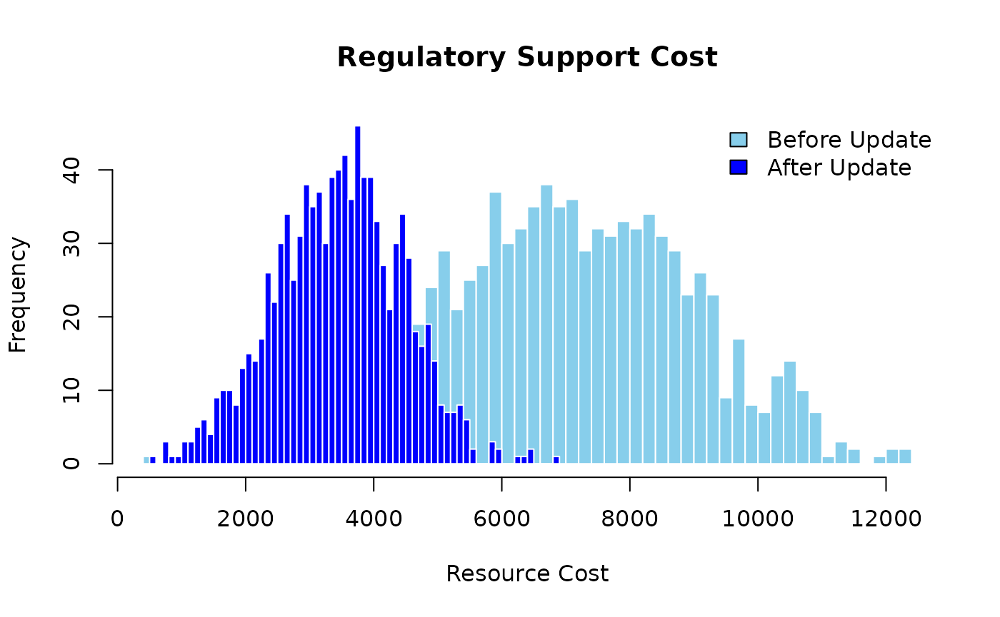

# Bayesian Networks Expanded

## Introduction

Similar to project-level risk analysis, Bayesian Networks are useful for
analyzing project portfolio risks. Bayesian Networks are probabilistic
graphical models that represent a set of variables and their conditional
dependencies via a directed acyclic graph (DAG). Bayesian Networks are
helpful for modeling complex systems and making inferences about the
relationships between variables.

## Project Portfolio Risk Analysis

Imagine a simple project portfolio. The portfolio consists of 3 civil
engineering projects: construction of a roadway, a small building
construction, and a pedestrian bridge project. The primary tasks for
these projects are as follows.

``` r
roadway_tasks <- data.frame(
  ID = c("AF", "AG", "AH", "AI", "AJ", "AK", "AL", "AM"),
  Label = c(
    "Task-1.1",
    "Task-1.2",
    "Task-1.3",
    "Task-1.4",
    "Task-1.5",
    "Task-1.6",
    "Task-1.7",
    "Task-1.8"
  ),
  Task = c(
    "Survey and Site Assessment",
    "Design and Planning",
    "Permitting and Approvals",
    "Excavation and Grading",
    "Pavement Installation",
    "Drainage and Utilities Installation",
    "Signage and Markings",
    "Final Inspection and Handover"
  ),
  Project_ID = rep("BF", 8)
)

knitr::kable(roadway_tasks, caption = "Project 1: Roadway Tasks")
```

| ID  | Label    | Task                                | Project_ID |
|:----|:---------|:------------------------------------|:-----------|
| AF  | Task-1.1 | Survey and Site Assessment          | BF         |
| AG  | Task-1.2 | Design and Planning                 | BF         |
| AH  | Task-1.3 | Permitting and Approvals            | BF         |
| AI  | Task-1.4 | Excavation and Grading              | BF         |
| AJ  | Task-1.5 | Pavement Installation               | BF         |
| AK  | Task-1.6 | Drainage and Utilities Installation | BF         |
| AL  | Task-1.7 | Signage and Markings                | BF         |
| AM  | Task-1.8 | Final Inspection and Handover       | BF         |

Project 1: Roadway Tasks

``` r

building_tasks <- data.frame(
  ID = c("AN", "AO", "AP", "AQ", "AR", "AS", "AT", "AU"),
  Label = c(
    "Task-2.1",
    "Task-2.2",
    "Task-2.3",
    "Task-2.4",
    "Task-2.5",
    "Task-2.6",
    "Task-2.7",
    "Task-2.8"
  ),
  Task = c(
    "Architectural Design",
    "Structural Engineering",
    "Regulatory Approvals",
    "Foundation and Excavation",
    "Framing and Structural Work",
    "Plumbing, Electrical, and HVAC Install",
    "Interior and Exterior Finishing",
    "Final Inspection and Handover"
  ),
  Project_ID = rep("BG", 8)
)

knitr::kable(building_tasks, caption = "Project 2: Building Tasks")
```

| ID  | Label    | Task                                   | Project_ID |
|:----|:---------|:---------------------------------------|:-----------|
| AN  | Task-2.1 | Architectural Design                   | BG         |
| AO  | Task-2.2 | Structural Engineering                 | BG         |
| AP  | Task-2.3 | Regulatory Approvals                   | BG         |
| AQ  | Task-2.4 | Foundation and Excavation              | BG         |
| AR  | Task-2.5 | Framing and Structural Work            | BG         |
| AS  | Task-2.6 | Plumbing, Electrical, and HVAC Install | BG         |
| AT  | Task-2.7 | Interior and Exterior Finishing        | BG         |
| AU  | Task-2.8 | Final Inspection and Handover          | BG         |

Project 2: Building Tasks

``` r

bridge_tasks <- data.frame(
  ID = c("AV", "AW", "AX", "AY", "AZ", "BA", "BB", "BC", "BD", "BE"),
  Label = c(
    "Task-3.1",
    "Task-3.2",
    "Task-3.3",
    "Task-3.4",
    "Task-3.5",
    "Task-3.6",
    "Task-3.7",
    "Task-3.8",
    "Task-3.9",
    "Task-3.10"
  ),
  Task = c(
    "Site Survey and Assessment",
    "Environmental Impact Study",
    "Concept Design and Planning",
    "Structural Engineering and Analysis",
    "Permitting and Approvals",
    "Foundation and Pile Installation",
    "Superstructure Construction",
    "Decking and Surface Finishing",
    "Inspection and Load Testing",
    "Final Handover"
  ),
  Project_ID = rep("BH", 10)
)

knitr::kable(bridge_tasks, caption = "Project 3: Bridge Tasks")
```

| ID  | Label     | Task                                | Project_ID |
|:----|:----------|:------------------------------------|:-----------|
| AV  | Task-3.1  | Site Survey and Assessment          | BH         |
| AW  | Task-3.2  | Environmental Impact Study          | BH         |
| AX  | Task-3.3  | Concept Design and Planning         | BH         |
| AY  | Task-3.4  | Structural Engineering and Analysis | BH         |
| AZ  | Task-3.5  | Permitting and Approvals            | BH         |
| BA  | Task-3.6  | Foundation and Pile Installation    | BH         |
| BB  | Task-3.7  | Superstructure Construction         | BH         |
| BC  | Task-3.8  | Decking and Surface Finishing       | BH         |
| BD  | Task-3.9  | Inspection and Load Testing         | BH         |
| BE  | Task-3.10 | Final Handover                      | BH         |

Project 3: Bridge Tasks

## Resources

Each project requires resources to complete the tasks. These resources
are allocated to the tasks based on the project requirements. The
resources for the projects are as follows.

``` r
roadway_resources <- data.frame(
  ID = c("F", "G", "H", "I", "J", "K", "L", "M"),
  Label = c(
    "Resource-1.1",
    "Resource-1.2",
    "Resource-1.3",
    "Resource-1.4",
    "Resource-1.5",
    "Resource-1.6",
    "Resource-1.7",
    "Resource-1.8"
  ),
  Resource = c(
    "Surveyer",
    "Engineer",
    "Regulatory Support",
    "Heavy Machinery",
    "Pavement and Related Machinery",
    "Drainage Material and Equipment",
    "Painters, Traffic Signs, Road Markers",
    "Inspectors and Quality Control Support"
  ),
  Task_ID = c("AF", "AG", "AH", "AI", "AJ", "AK", "AL", "AM"),
  Task = c(
    "Survey and Site Assessment",
    "Design and Planning",
    "Permitting and Approvals",
    "Excavation and Grading",
    "Pavement Installation",
    "Drainage and Utilities Installation",
    "Signage and Markings",
    "Final Inspection and Handover"
  ),
  Mean = c(
    10000,
    20000,
    3500,
    35000,
    100000,
    25000,
    6500,
    2000
  ),
  SD = c(
    2000,
    5000,
    1000,
    10000,
    20000,
    5000,
    1500,
    500
  )
)

knitr::kable(roadway_resources, caption = "Project 1: Roadway Resources")
```

| ID  | Label        | Resource                               | Task_ID | Task                                |   Mean |    SD |
|:----|:-------------|:---------------------------------------|:--------|:------------------------------------|-------:|------:|
| F   | Resource-1.1 | Surveyer                               | AF      | Survey and Site Assessment          |  10000 |  2000 |
| G   | Resource-1.2 | Engineer                               | AG      | Design and Planning                 |  20000 |  5000 |
| H   | Resource-1.3 | Regulatory Support                     | AH      | Permitting and Approvals            |   3500 |  1000 |
| I   | Resource-1.4 | Heavy Machinery                        | AI      | Excavation and Grading              |  35000 | 10000 |
| J   | Resource-1.5 | Pavement and Related Machinery         | AJ      | Pavement Installation               | 100000 | 20000 |
| K   | Resource-1.6 | Drainage Material and Equipment        | AK      | Drainage and Utilities Installation |  25000 |  5000 |
| L   | Resource-1.7 | Painters, Traffic Signs, Road Markers  | AL      | Signage and Markings                |   6500 |  1500 |
| M   | Resource-1.8 | Inspectors and Quality Control Support | AM      | Final Inspection and Handover       |   2000 |   500 |

Project 1: Roadway Resources

``` r

building_resources <- data.frame(
  ID = c("N", "O", "P", "Q", "R", "S", "T", "U"),
  Label = c(
    "Resource-2.1",
    "Resource-2.2",
    "Resource-2.3",
    "Resource-2.4",
    "Resource-2.5",
    "Resource-2.6",
    "Resource-2.7",
    "Resource-2.8"
  ),
  Resource = c(
    "Architect",
    "Structural Engineer",
    "Regulatory Support",
    "Heavy Machinery",
    "Building Materials",
    "Plumbers, Electricians",
    "Painters, Interior Finishers",
    "Inspector and Quality Control Support"
  ),
  Task_ID = c("AN", "AO", "AP", "AQ", "AR", "AS", "AT", "AU"),
  Task = c(
    "Architectural Design",
    "Structural Engineering",
    "Regulatory Approvals",
    "Foundation and Excavation",
    "Framing and Structural Work",
    "Plumbing, Electrical, and HVAC Install",
    "Interior and Exterior Finishing",
    "Final Inspection and Handover"
  ),
  Mean = c(
    15000,
    30000,
    4000,
    40000,
    100000,
    20000,
    8000,
    2500
  ),
  SD = c(
    3000,
    6000,
    1000,
    10000,
    20000,
    4000,
    1500,
    500
  )
)

knitr::kable(building_resources, caption = "Project 2: Building Resources")
```

| ID  | Label        | Resource                              | Task_ID | Task                                   |   Mean |    SD |
|:----|:-------------|:--------------------------------------|:--------|:---------------------------------------|-------:|------:|
| N   | Resource-2.1 | Architect                             | AN      | Architectural Design                   |  15000 |  3000 |
| O   | Resource-2.2 | Structural Engineer                   | AO      | Structural Engineering                 |  30000 |  6000 |
| P   | Resource-2.3 | Regulatory Support                    | AP      | Regulatory Approvals                   |   4000 |  1000 |
| Q   | Resource-2.4 | Heavy Machinery                       | AQ      | Foundation and Excavation              |  40000 | 10000 |
| R   | Resource-2.5 | Building Materials                    | AR      | Framing and Structural Work            | 100000 | 20000 |
| S   | Resource-2.6 | Plumbers, Electricians                | AS      | Plumbing, Electrical, and HVAC Install |  20000 |  4000 |
| T   | Resource-2.7 | Painters, Interior Finishers          | AT      | Interior and Exterior Finishing        |   8000 |  1500 |
| U   | Resource-2.8 | Inspector and Quality Control Support | AU      | Final Inspection and Handover          |   2500 |   500 |

Project 2: Building Resources

``` r

bridge_resources <- data.frame(
  ID = c("V", "W", "X", "Y", "Z", "AA", "AB", "AC", "AD", "AE"),
  Label = c(
    "Resource-3.1",
    "Resource-3.2",
    "Resource-3.3",
    "Resource-3.4",
    "Resource-3.5",
    "Resource-3.6",
    "Resource-3.7",
    "Resource-3.8",
    "Resource-3.9",
    "Resource-3-10"
  ),
  Resource = c(
    "Surveyor",
    "Environmental Scientist",
    "Civil Engineer",
    "Structural Engineer",
    "Regulatory Consulting",
    "Heavy Machinery",
    "Steel and Concrete Materials",
    "Decking Materials",
    "Inspector and Quality Control Support",
    "Handover Team"
  ),
  Task_ID = c("AV", "AW", "AX", "AY", "AZ", "BA", "BB", "BC", "BD", "BE"),
  Task = c(
    "Site Survey and Assessment",
    "Environmental Impact Study",
    "Concept Design and Planning",
    "Structural Engineering and Analysis",
    "Permitting and Approvals",
    "Foundation and Pile Installation",
    "Superstructure Construction",
    "Decking and Surface Finishing",
    "Inspection and Load Testing",
    "Final Handover"
  ),
  Mean = c(
    10000,
    20000,
    30000,
    40000,
    5000,
    50000,
    100000,
    20000,
    5000,
    10000
  ),
  SD = c(
    2000,
    4000,
    6000,
    8000,
    1000,
    10000,
    20000,
    4000,
    1000,
    2000
  )
)

knitr::kable(bridge_resources, caption = "Project 3: Bridge Resources")
```

| ID  | Label         | Resource                              | Task_ID | Task                                |  Mean |    SD |
|:----|:--------------|:--------------------------------------|:--------|:------------------------------------|------:|------:|
| V   | Resource-3.1  | Surveyor                              | AV      | Site Survey and Assessment          | 1e+04 |  2000 |
| W   | Resource-3.2  | Environmental Scientist               | AW      | Environmental Impact Study          | 2e+04 |  4000 |
| X   | Resource-3.3  | Civil Engineer                        | AX      | Concept Design and Planning         | 3e+04 |  6000 |
| Y   | Resource-3.4  | Structural Engineer                   | AY      | Structural Engineering and Analysis | 4e+04 |  8000 |
| Z   | Resource-3.5  | Regulatory Consulting                 | AZ      | Permitting and Approvals            | 5e+03 |  1000 |
| AA  | Resource-3.6  | Heavy Machinery                       | BA      | Foundation and Pile Installation    | 5e+04 | 10000 |
| AB  | Resource-3.7  | Steel and Concrete Materials          | BB      | Superstructure Construction         | 1e+05 | 20000 |
| AC  | Resource-3.8  | Decking Materials                     | BC      | Decking and Surface Finishing       | 2e+04 |  4000 |
| AD  | Resource-3.9  | Inspector and Quality Control Support | BD      | Inspection and Load Testing         | 5e+03 |  1000 |
| AE  | Resource-3-10 | Handover Team                         | BE      | Final Handover                      | 1e+04 |  2000 |

Project 3: Bridge Resources

## Risks

Each project is also subject to risks that can impact the project
outcomes. Each risk event has a probability of occurrence and an impact
on the project. The risks for the projects are as follows.

``` r
roadway_risks <- data.frame(
  Risk_ID = c("A", "B", "C"),
  Name = c(
    "Risk-1",
    "Risk-2",
    "Risk-3"
  ),
  Risk = c(
    "Delays in Permitting and Approvals",
    "Unforeseen Site Conditions",
    "Material Price Fluctuations"
  ),
  Probability = c(
    0.9,
    0.95,
    0.8
  ),
  Resource_ID = c("H", "I", "J"),
  Resource_Impacted = c(
    "Regulatory Support",
    "Heavy Machinery",
    "Pavement and Related Machinery"
  ),
  Mean = c(
    7000,
    70000,
    200000
  ),
  SD = c(
    2000,
    20000,
    40000
  )
)

knitr::kable(roadway_risks, caption = "Project 1: Roadway Risks")
```

| Risk_ID | Name   | Risk                               | Probability | Resource_ID | Resource_Impacted              |  Mean |    SD |
|:--------|:-------|:-----------------------------------|------------:|:------------|:-------------------------------|------:|------:|
| A       | Risk-1 | Delays in Permitting and Approvals |        0.90 | H           | Regulatory Support             | 7e+03 |  2000 |
| B       | Risk-2 | Unforeseen Site Conditions         |        0.95 | I           | Heavy Machinery                | 7e+04 | 20000 |
| C       | Risk-3 | Material Price Fluctuations        |        0.80 | J           | Pavement and Related Machinery | 2e+05 | 40000 |

Project 1: Roadway Risks

``` r

building_risks <- data.frame(
  Risk_ID = c("A", "D", "C"),
  Name = c(
    "Risk-1",
    "Risk-4",
    "Risk-3"
  ),
  Risk = c(
    "Delays in Permitting and Approvals",
    "Labor Shortage or Skills Gap",
    "Material Price Volatility"
  ),
  Probability = c(
    0.9,
    0.9,
    0.8
  ),
  Resource_ID = c("P", "S", "O"),
  Resource = c(
    "Regulatory Support",
    "Plumbers, Electricians",
    "Building Materials"
  ),
  Mean = c(
    8000,
    40000,
    60000
  ),
  SD = c(
    2000,
    8000,
    12000
  )
)

knitr::kable(building_risks, caption = "Project 2: Building Risks")
```

| Risk_ID | Name   | Risk                               | Probability | Resource_ID | Resource               |  Mean |    SD |
|:--------|:-------|:-----------------------------------|------------:|:------------|:-----------------------|------:|------:|
| A       | Risk-1 | Delays in Permitting and Approvals |         0.9 | P           | Regulatory Support     |  8000 |  2000 |
| D       | Risk-4 | Labor Shortage or Skills Gap       |         0.9 | S           | Plumbers, Electricians | 40000 |  8000 |
| C       | Risk-3 | Material Price Volatility          |         0.8 | O           | Building Materials     | 60000 | 12000 |

Project 2: Building Risks

``` r

bridge_risks <- data.frame(
  Risk_ID = c("B", "D", "E"),
  Name = c(
    "Risk-2",
    "Risk-4",
    "Risk-5"
  ),
  Risk = c(
    "Unforeseen Environmental Conditions",
    "Labor Supply Disruptions",
    "Structural Design Revisions"
  ),
  Probabiliy = c(
    0.95,
    0.9,
    0.95
  ),
  Resource_ID = c("W", "AD", "Y"),
  Resource = c(
    "Environmental Scientist",
    "Inspector and Quality Control Support",
    "Structural Engineer"
  ),
  Mean = c(
    40000,
    10000,
    80000
  ),
  SD = c(
    9000,
    2000,
    16000
  )
)

knitr::kable(bridge_risks, caption = "Project 3: Bridge Risks")
```

| Risk_ID | Name   | Risk                                | Probabiliy | Resource_ID | Resource                              |  Mean |    SD |
|:--------|:-------|:------------------------------------|-----------:|:------------|:--------------------------------------|------:|------:|
| B       | Risk-2 | Unforeseen Environmental Conditions |       0.95 | W           | Environmental Scientist               | 40000 |  9000 |
| D       | Risk-4 | Labor Supply Disruptions            |       0.90 | AD          | Inspector and Quality Control Support | 10000 |  2000 |
| E       | Risk-5 | Structural Design Revisions         |       0.95 | Y           | Structural Engineer                   | 80000 | 16000 |

Project 3: Bridge Risks

Notice how the risks are associated with the resources. The risks can
impact the resources, and the resources can ultimately impact the
project outcomes. Most of the risks are also common across the projects.
For example, Risk 1 is common across all three projects. If Risk 1
occurs, the impact will be felt across all three.

## Bayesian Network

A Bayesian network is useful for modeling project portfolio risks. The
Bayesian Network represents the dependencies between the projects,
tasks, resources, and risks. The network helps in understanding the
relationships between the variables and in making inferences about the
risks.

First, define the nodes and edges of the Bayesian network. The nodes
represent the variables, and the edges represent the dependencies
between the variables. The following code defines the nodes and edges of
the Bayesian network.

``` r
nodes <- data.frame(
  id = c(
    "A", "B", "C", "D", "E", "F", "G", "H", "I", "J", "K", "L", "M", "N",
    "O", "P", "Q", "R", "S", "T", "U", "V", "W", "X", "Y", "Z", "AA", "AB",
    "AC", "AD", "AE", "AF", "AG", "AH", "AI", "AJ", "AK", "AL", "AM", "AN",
    "AO", "AP", "AQ", "AR", "AS", "AT", "AU", "AV", "AW", "AX", "AY", "AZ",
    "BA", "BB", "BC", "BD", "BE", "BF", "BG", "BH", "BI"
  ),
  label = c(
    "Risk-1",
    "Risk-2",
    "Risk-3",
    "Risk-4",
    "Risk-5",
    "Resource-1.1",
    "Resource-1.2",
    "Resource-1.3",
    "Resource-1.4",
    "Resource-1.5",
    "Resource-1.6",
    "Resource-1.7",
    "Resource-1.8",
    "Resource-2.1",
    "Resource-2.2",
    "Resource-2.3",
    "Resource-2.4",
    "Resource-2.5",
    "Resource-2.6",
    "Resource-2.7",
    "Resource-2.8",
    "Resource-3.1",
    "Resource-3.2",
    "Resource-3.3",
    "Resource-3.4",
    "Resource-3.5",
    "Resource-3.6",
    "Resource-3.7",
    "Resource-3.8",
    "Resource-3.9",
    "Resource-3-10",
    "Task-1.1",
    "Task-1.2",
    "Task-1.3",
    "Task-1.4",
    "Task-1.5",
    "Task-1.6",
    "Task-1.7",
    "Task-1.8",
    "Task-2.1",
    "Task-2.2",
    "Task-2.3",
    "Task-2.4",
    "Task-2.5",
    "Task-2.6",
    "Task-2.7",
    "Task-2.8",
    "Task-3.1",
    "Task-3.2",
    "Task-3.3",
    "Task-3.4",
    "Task-3.5",
    "Task-3.6",
    "Task-3.7",
    "Task-3.8",
    "Task-3.9",
    "Task-3.10",
    "Project 1",
    "Project 2",
    "Project 3",
    "Project Portfolio"
  ),
  group = c(
    "Risk",
    "Risk",
    "Risk",
    "Risk",
    "Risk",
    "Resource",
    "Resource",
    "Resource",
    "Resource",
    "Resource",
    "Resource",
    "Resource",
    "Resource",
    "Resource",
    "Resource",
    "Resource",
    "Resource",
    "Resource",
    "Resource",
    "Resource",
    "Resource",
    "Resource",
    "Resource",
    "Resource",
    "Resource",
    "Resource",
    "Resource",
    "Resource",
    "Resource",
    "Resource",
    "Resource",
    "Task",
    "Task",
    "Task",
    "Task",
    "Task",
    "Task",
    "Task",
    "Task",
    "Task",
    "Task",
    "Task",
    "Task",
    "Task",
    "Task",
    "Task",
    "Task",
    "Task",
    "Task",
    "Task",
    "Task",
    "Task",
    "Task",
    "Task",
    "Task",
    "Task",
    "Task",
    "Project",
    "Project",
    "Project",
    "Portfolio"
  ),
  stringsAsFactors = FALSE
)
```

Next, define the edges of the Bayesian network. The following code
defines the edges of the Bayesian network.

``` r
links <- data.frame(
  source = c(
    "A", "B", "C", "A", "D", "C", "B", "D", "E", "F", "G", "H", "I",
    "J", "K", "L", "M", "N", "O", "P", "Q", "R", "S", "T", "U", "V", "W",
    "X", "Y", "Z", "AA", "AB", "AC", "AD", "AE", "AF", "AG", "AH", "AI",
    "AJ", "AK", "AL", "AM", "AN", "AO", "AP", "AQ", "AR", "AS", "AT", "AU",
    "AV", "AW", "AX", "AY", "AZ", "BA", "BB", "BC", "BD", "BE", "BF", "BG",
    "BH"
  ),
  target = c(
    "H", "I", "J", "P", "S", "O", "W", "AD", "Y", "AF", "AG", "AH", "AI",
    "AJ", "AK", "AL", "AM", "AN", "AO", "AP", "AQ", "AR", "AS", "AT", "AU",
    "AV", "AW", "AX", "AY", "AZ", "BA", "BB", "BC", "BD", "BE", "BF", "BF",
    "BF", "BF", "BF", "BF", "BF", "BF", "BG", "BG", "BG", "BG", "BG", "BG",
    "BG", "BG", "BH", "BH", "BH", "BH", "BH", "BH", "BH", "BH", "BH", "BH",
    "BI", "BI", "BI"
  ),
  value = rep(1, 64)
)
```

Then define the distributions for the nodes. The distributions represent
the probabilities of the outcomes for each node. The following code
defines the distributions for the nodes.

``` r
distributions <- list(
  A = list(
    type = "discrete",
    values = c(1, 0),
    probs = c(0.9, 0.1)
  ),
  B = list(
    type = "discrete",
    values = c(1, 0),
    probs = c(0.95, 0.05)
  ),
  C = list(
    type = "discrete",
    values = c(1, 0),
    probs = c(0.8, 0.2)
  ),
  D = list(
    type = "discrete",
    values = c(1, 0),
    probs = c(0.9, 0.1)
  ),
  E = list(
    type = "discrete",
    values = c(1, 0),
    probs = c(0.95, 0.05)
  ),
  F = list(
    type = "normal",
    mean = 10000,
    sd = 2000
  ),
  G = list(
    type = "normal",
    mean = 20000,
    sd = 5000
  ),
  H = list(
    type = "conditional",
    condition = c("A"),
    true_dist = list(
      type = "normal",
      mean = 7000,
      sd = 2000
    ),
    false_dist = list(
      type = "normal",
      mean = 3500,
      sd = 1000
    )
  ),
  I = list(
    type = "conditional",
    condition = c("B"),
    true_dist = list(
      type = "normal",
      mean = 70000,
      sd = 20000
    ),
    false_dist = list(
      type = "normal",
      mean = 35000,
      sd = 10000
    )
  ),
  J = list(
    type = "conditional",
    condition = c("C"),
    true_dist = list(
      type = "normal",
      mean = 100000,
      sd = 40000
    ),
    false_dist = list(
      type = "normal",
      mean = 50000,
      sd = 20000
    )
  ),
  K = list(
    type = "normal",
    mean = 25000,
    sd = 5000
  ),
  L = list(
    type = "normal",
    mean = 6500,
    sd = 1500
  ),
  M = list(
    type = "normal",
    mean = 2000,
    sd = 500
  ),
  N = list(
    type = "normal",
    mean = 15000,
    sd = 3000
  ),
  O = list(
    type = "conditional",
    condition = c("C"),
    true_dist = list(
      type = "normal",
      mean = 8000,
      sd = 2000
    ),
    false_dist = list(
      type = "normal",
      mean = 4000,
      sd = 1000
    )
  ),
  P = list(
    type = "conditional",
    condition = c("A"),
    true_dist = list(
      type = "normal",
      mean = 8000,
      sd = 2000
    ),
    false_dist = list(
      type = "normal",
      mean = 4000,
      sd = 1000
    )
  ),
  Q = list(
    type = "normal",
    mean = 40000,
    sd = 10000
  ),
  R = list(
    type = "normal",
    mean = 100000,
    sd = 20000
  ),
  S = list(
    type = "conditional",
    condition = c("D"),
    true_dist = list(
      type = "normal",
      mean = 16000,
      sd = 4000
    ),
    false_dist = list(
      type = "normal",
      mean = 8000,
      sd = 2000
    )
  ),
  T = list(
    type = "normal",
    mean = 8000,
    sd = 1500
  ),
  U = list(
    type = "normal",
    mean = 2500,
    sd = 500
  ),
  V = list(
    type = "normal",
    mean = 10000,
    sd = 2000
  ),
  W = list(
    type = "conditional",
    condition = c("B"),
    true_dist = list(
      type = "normal",
      mean = 60000,
      sd = 4000
    ),
    false_dist = list(
      type = "normal",
      mean = 30000,
      sd = 2000
    )
  ),
  X = list(
    type = "normal",
    mean = 30000,
    sd = 6000
  ),
  Y = list(
    type = "conditional",
    condition = c("E"),
    true_dist = list(
      type = "normal",
      mean = 20000,
      sd = 2000
    ),
    false_dist = list(
      type = "normal",
      mean = 10000,
      sd = 1000
    )
  ),
  Z = list(
    type = "normal",
    mean = 5000,
    sd = 1000
  ),
  AA = list(
    type = "normal",
    mean = 50000,
    sd = 10000
  ),
  AB = list(
    type = "normal",
    mean = 100000,
    sd = 20000
  ),
  AC = list(
    type = "normal",
    mean = 20000,
    sd = 4000
  ),
  AD = list(
    type = "conditional",
    condition = c("D"),
    true_dist = list(
      type = "normal",
      mean = 40000,
      sd = 8000
    ),
    false_dist = list(
      type = "normal",
      mean = 20000,
      sd = 4000
    )
  ),
  AE = list(
    type = "normal",
    mean = 10000,
    sd = 2000
  ),
  AF = list(
    type = "aggregate",
    nodes = c("F")
  ),
  AG = list(
    type = "aggregate",
    nodes = c("G")
  ),
  AH = list(
    type = "aggregate",
    nodes = c("H")
  ),
  AI = list(
    type = "aggregate",
    nodes = c("I")
  ),
  AJ = list(
    type = "aggregate",
    nodes = c("J")
  ),
  AK = list(
    type = "aggregate",
    nodes = c("K")
  ),
  AL = list(
    type = "aggregate",
    nodes = c("L")
  ),
  AM = list(
    type = "aggregate",
    nodes = c("M")
  ),
  AN = list(
    type = "aggregate",
    nodes = c("N")
  ),
  AO = list(
    type = "aggregate",
    nodes = c("O")
  ),
  AP = list(
    type = "aggregate",
    nodes = c("P")
  ),
  AQ = list(
    type = "aggregate",
    nodes = c("Q")
  ),
  AR = list(
    type = "aggregate",
    nodes = c("R")
  ),
  AS = list(
    type = "aggregate",
    nodes = c("S")
  ),
  AT = list(
    type = "aggregate",
    nodes = c("T")
  ),
  AU = list(
    type = "aggregate",
    nodes = c("U")
  ),
  AV = list(
    type = "aggregate",
    nodes = c("V")
  ),
  AW = list(
    type = "aggregate",
    nodes = c("W")
  ),
  AX = list(
    type = "aggregate",
    nodes = c("X")
  ),
  AY = list(
    type = "aggregate",
    nodes = c("Y")
  ),
  AZ = list(
    type = "aggregate",
    nodes = c("Z")
  ),
  BA = list(
    type = "aggregate",
    nodes = c("AA")
  ),
  BB = list(
    type = "aggregate",
    nodes = c("AB")
  ),
  BC = list(
    type = "aggregate",
    nodes = c("AC")
  ),
  BD = list(
    type = "aggregate",
    nodes = c("AD")
  ),
  BE = list(
    type = "aggregate",
    nodes = c("AE")
  ),
  BF = list(
    type = "aggregate",
    nodes = c("AF", "AG", "AH", "AI", "AJ", "AK", "AL", "AM")
  ),
  BG = list(
    type = "aggregate",
    nodes = c("AN", "AO", "AP", "AQ", "AR", "AS", "AT", "AU")
  ),
  BH = list(
    type = "aggregate",
    nodes = c("AV", "AW", "AX", "AY", "AZ", "BA", "BB", "BC", "BD", "BE")
  ),
  BI = list(
    type = "aggregate",
    nodes = c("BF", "BG", "BH")
  )
)
```

Finally, define the Bayesian network using the nodes, edges, and
distributions. The following code defines the Bayesian network.

``` r
library(PRA)
graph <- prob_net(nodes, links, distributions = distributions)
```

The Bayesian network can be visualized using the igraph and networkD3
packages. The igraph package provides functions for creating and
analyzing graph structures, and the networkD3 package provides functions
for creating interactive network visualizations.

``` r
library(igraph)
library(networkD3)
g <- graph_from_data_frame(graph$links, vertices = graph$nodes, directed = TRUE)
d3g <- igraph_to_networkD3(g, group = graph$nodes$group)
forceNetwork(
  Links = d3g$links, Nodes = d3g$nodes, NodeID = "name", Group = "group", Value = "value",
  zoom = TRUE, legend = TRUE, arrows = TRUE, opacity = 0.8, fontSize = 14
)
```

## Inference

To analyze the Bayesian network, use probabilistic inference to
calculate the probabilities of different outcomes. Probabilistic
inference is the process of estimating the probability distribution of a
variable given evidence about other variables. Inference helps in making
predictions about the risks based on the observed data.

``` r
simulation_results <- prob_net_sim(graph, num_samples = 1000)
```

The simulation results can be used to estimate the total project
portfolio cost and assess the impact of risks on the project outcomes.
The following code estimates the total portfolio cost.

``` r
hist <- hist(simulation_results$BI, breaks = 50, plot = FALSE)
plot(hist, main = "Total Project Portfolio Cost", xlab = "Project Cost", col = "skyblue", border = "white")
```


The histogram shows the distribution of the total portfolio cost. The
histogram helps in understanding the range of possible project costs and
assess the impact of risks on the project outcomes.

## Learning

The Bayesian network can be updated with new data to improve the model’s
accuracy. Learning the Bayesian network involves updating the
distributions based on new evidence. The updated Bayesian network can be
used to make more accurate predictions about the risks.

For example, if Risk 1.2 occurred, the Bayesian network can be updated
with this new data. The following code updates the Bayesian network with
the new data.

``` r
updated_results <- prob_net_learn(graph,
  observations = list(B = "Yes"),
  num_samples = 1000
)
```

The updated results can be compared with the original results to see how
the changes in the risk probabilities affect the project outcomes. The
following code compares the results before and after updating the
Bayesian network.

``` r
hist <- hist(simulation_results$I, breaks = 50, plot = FALSE)
hist2 <- hist(updated_results$I, breaks = 50, plot = FALSE)
plot(hist,
  main = "Heavy Machinery Cost", xlab = "Resource Cost",
  col = "skyblue", border = "white"
)
plot(hist2, col = "blue", border = "white", add = TRUE)
legend("topright",
  legend = c("Before Update", "After Update"),
  fill = c("skyblue", "blue"), bty = "n"
)
```


## Updating

Similarly, the Bayesian network can be updated by adding or removing
arcs between nodes. Adding or removing arcs changes the dependencies
between the variables and improve the model’s accuracy.

For example, suppose Resource 1.3 is no longer at risk of delays. Remove
the arc between Resource 1.3 and Risk 1.1 to account for this new
information. The following code removes the arc between Resource 1.3 and
Risk 1.1.

``` r
remove_links <- data.frame(
  source = c("A"),
  target = c("H"),
  stringsAsFactors = FALSE
)
update_distributions <- list(
  H = list(
    type = "normal",
    mean = 3500,
    sd = 1000
  )
)
updated_graph <- prob_net_update(graph,
  remove_links = remove_links,
  update_distributions = update_distributions
)
updated_results <- prob_net_sim(updated_graph, num_samples = 1000)
```

Just as before, the updated results can be compared with the original
results to see how the changes in the network structure affect the
project outcomes.

``` r
hist <- hist(simulation_results$H, breaks = 50, plot = FALSE)
hist2 <- hist(updated_results$H, breaks = 50, plot = FALSE)
plot(hist,
  main = "Regulatory Support Cost", xlab = "Resource Cost",
  col = "skyblue", border = "white", ylim = c(0, max(hist$counts, hist2$counts))
)
plot(hist2, col = "blue", border = "white", add = TRUE)
legend("topright",
  legend = c("Before Update", "After Update"),
  fill = c("skyblue", "blue"), bty = "n"
)
```



## Conclusion

In this vignette, Bayesian Networks were used to analyze project
portfolio risks. The projects, tasks, resources, and risks for a simple
project portfolio were defined. A Bayesian network was then constructed
to represent the dependencies between the variables. Probabilistic
inference was applied to assess the risks and estimate the total project
cost. The Bayesian network was also updated with new data to improve the
model’s accuracy. Overall, the Bayesian network served as a powerful
tool for modeling project portfolio risks and supporting informed
decision-making regarding project outcomes.
