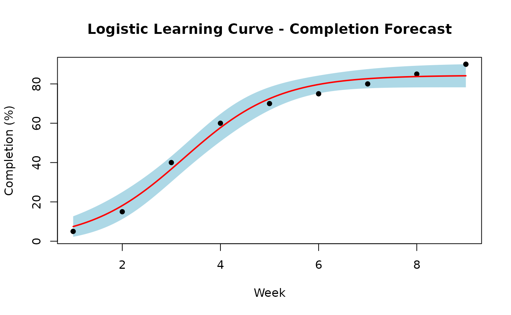
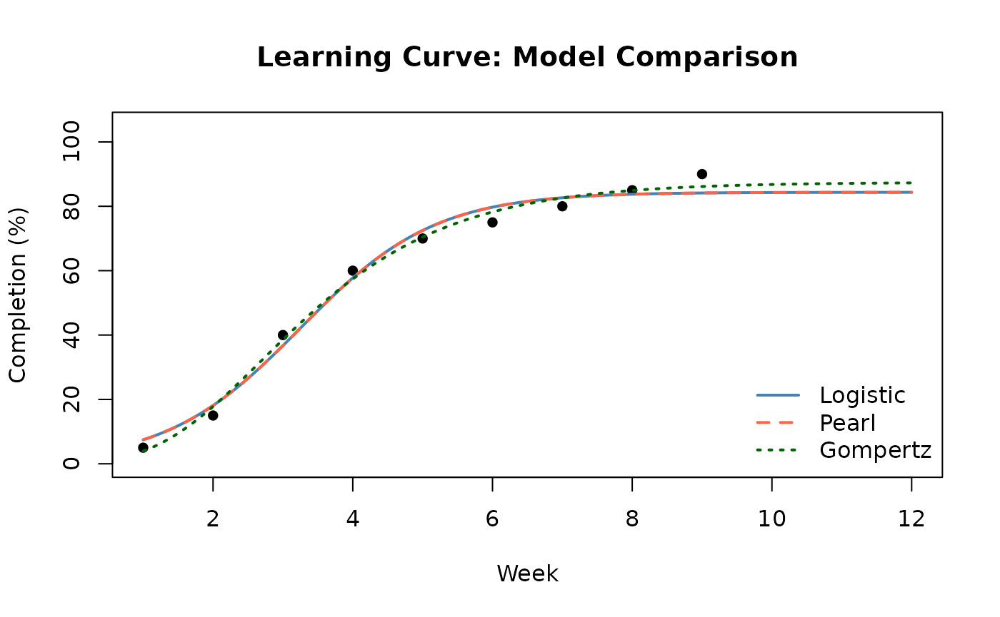

# Learning Curves

Learning curves model how efficiency or completion rate evolves over
time as a team gains experience. In project management they are used to:

- **Forecast completion**: Predict when a task or deliverable will reach
  100% based on past progress.
- **Identify acceleration**: Detect when a project is in its
  rapid-improvement phase versus plateauing.
- **Set realistic milestones**: Calibrate schedule targets against
  demonstrated learning rates.

## Sigmoidal Models

Sigmoidal (S-shaped) functions capture the three phases of learning:
slow start, rapid improvement, and plateau. The PRA package provides
three model types:

| Model        | Formula                   | Parameters                                            |
|--------------|---------------------------|-------------------------------------------------------|
| **Logistic** | K / (1 + exp(−r(t − t₀))) | K = ceiling; r = growth rate; t₀ = inflection time    |
| **Pearl**    | K / (1 + exp(−r(t − t₀))) | Same as logistic (identical functional form)          |
| **Gompertz** | A · exp(−b · exp(−c · t)) | A = ceiling; c = growth rate; b = initial suppression |

**Parameter interpretation (Logistic / Pearl):** - **K** — the maximum
achievable value (e.g., 100% completion) - **r** — how fast the S-curve
rises; larger r = steeper transition - **t₀** — the time at which the
outcome is at its midpoint (inflection point)

## Example: Fitting a Logistic Model

``` r
library(PRA)
```

We have weekly completion percentage data for a construction deliverable
over 9 weeks.

``` r
data <- data.frame(
  time       = 1:9,
  completion = c(5, 15, 40, 60, 70, 75, 80, 85, 90)
)
```

### Fit the Model

``` r
fit <- fit_sigmoidal(data, "time", "completion", "logistic")
```

### Assess Fit Quality

Use [`summary()`](https://rdrr.io/r/base/summary.html) to examine the
fitted coefficients, their standard errors, and the residual standard
error — a measure of how closely the model matches the observed data.

``` r
summary(fit)
#> 
#> Formula: y ~ logistic(x, K, r, t0)
#> 
#> Parameters:
#>    Estimate Std. Error t value Pr(>|t|)    
#> K   84.3515     2.5142  33.550 4.67e-08 ***
#> r    1.0356     0.1380   7.505 0.000289 ***
#> t0   3.2520     0.1459  22.284 5.34e-07 ***
#> ---
#> Signif. codes:  0 '***' 0.001 '**' 0.01 '*' 0.05 '.' 0.1 ' ' 1
#> 
#> Residual standard error: 4.148 on 6 degrees of freedom
#> 
#> Number of iterations to convergence: 10 
#> Achieved convergence tolerance: 1.49e-08
```

A small residual standard error (relative to the response scale)
indicates a good fit. Coefficient `t values` with \|t\| \> 2 are
statistically meaningful.

### Plot with Confidence Bands

[`plot_sigmoidal()`](https://paulgovan.github.io/PRA/reference/plot_sigmoidal.md)
plots the data, fitted curve, and optional confidence bounds in a single
call.

``` r
plot_sigmoidal(
  fit, data, "time", "completion", "logistic",
  conf_level = 0.95,
  main = "Logistic Learning Curve - Completion Forecast",
  xlab = "Week",
  ylab = "Completion (%)"
)
```



The shaded region is the 95% confidence band — the range within which
the true fitted curve is likely to lie. Wider bands at the tails reflect
greater uncertainty in extrapolated predictions.

### Predict Future Completion

Use
[`predict_sigmoidal()`](https://paulgovan.github.io/PRA/reference/predict_sigmoidal.md)
to generate numeric forecasts, including confidence bounds for specific
future time points.

``` r
future_times <- seq(1, 12, length.out = 100)
predictions <- predict_sigmoidal(fit, future_times, "logistic", conf_level = 0.95)

knitr::kable(
  tail(round(predictions, 1), 5),
  caption = "Predicted completion (final 5 points)",
  row.names = FALSE
)
```

|    x | pred |  lwr |  upr |
|-----:|-----:|-----:|-----:|
| 11.6 | 84.3 | 78.2 | 90.5 |
| 11.7 | 84.3 | 78.2 | 90.5 |
| 11.8 | 84.3 | 78.2 | 90.5 |
| 11.9 | 84.3 | 78.2 | 90.5 |
| 12.0 | 84.3 | 78.2 | 90.5 |

Predicted completion (final 5 points)

## Comparing All Three Model Types

Different model types can produce different forecasts, especially in the
tails. It is good practice to fit multiple models and compare their
goodness-of-fit.

``` r
fit_logistic <- fit_sigmoidal(data, "time", "completion", "logistic")
fit_pearl <- fit_sigmoidal(data, "time", "completion", "pearl")
fit_gompertz <- fit_sigmoidal(data, "time", "completion", "gompertz")
```

``` r
# Residual standard errors for comparison
rse <- function(fit) summary(fit)$sigma

comparison <- data.frame(
  Model = c("Logistic", "Pearl", "Gompertz"),
  Residual_StdError = round(c(rse(fit_logistic), rse(fit_pearl), rse(fit_gompertz)), 3)
)
knitr::kable(comparison, caption = "Model Fit Comparison (lower RSE = better fit)")
```

| Model    | Residual_StdError |
|:---------|------------------:|
| Logistic |             4.148 |
| Pearl    |             4.148 |
| Gompertz |             2.887 |

Model Fit Comparison (lower RSE = better fit)

Now plot all three fits side by side:

``` r
x_seq <- seq(1, 12, length.out = 200)

pred_log <- predict_sigmoidal(fit_logistic, x_seq, "logistic")
pred_prl <- predict_sigmoidal(fit_pearl, x_seq, "pearl")
pred_gom <- predict_sigmoidal(fit_gompertz, x_seq, "gompertz")

# Base plot with observed data
plot(data$time, data$completion,
  pch = 16, xlim = c(1, 12), ylim = c(0, 105),
  main = "Learning Curve: Model Comparison",
  xlab = "Week", ylab = "Completion (%)"
)
lines(pred_log$x, pred_log$pred, col = "steelblue", lwd = 2)
lines(pred_prl$x, pred_prl$pred, col = "tomato", lwd = 2, lty = 2)
lines(pred_gom$x, pred_gom$pred, col = "darkgreen", lwd = 2, lty = 3)
legend("bottomright",
  legend = c("Logistic", "Pearl", "Gompertz"),
  col = c("steelblue", "tomato", "darkgreen"),
  lty = c(1, 2, 3), lwd = 2, bty = "n"
)
```



**Note:** Logistic and Pearl share the same functional form and will
produce identical fits on the same data. Gompertz has a different shape
— its inflection point occurs earlier and the curve is asymmetric —
making it better suited for processes that accelerate quickly early on.

## Summary

The sigmoidal workflow in PRA:

1.  [`fit_sigmoidal()`](https://paulgovan.github.io/PRA/reference/fit_sigmoidal.md)
    — fit a model to observed time-completion data
2.  `summary(fit)` — inspect coefficient estimates and goodness-of-fit
3.  [`predict_sigmoidal()`](https://paulgovan.github.io/PRA/reference/predict_sigmoidal.md)
    — generate numeric forecasts with optional confidence bounds
4.  [`plot_sigmoidal()`](https://paulgovan.github.io/PRA/reference/plot_sigmoidal.md)
    — visualize the fit and confidence band

Choose the model type based on the shape of your data and theoretical
expectations about the learning process.
