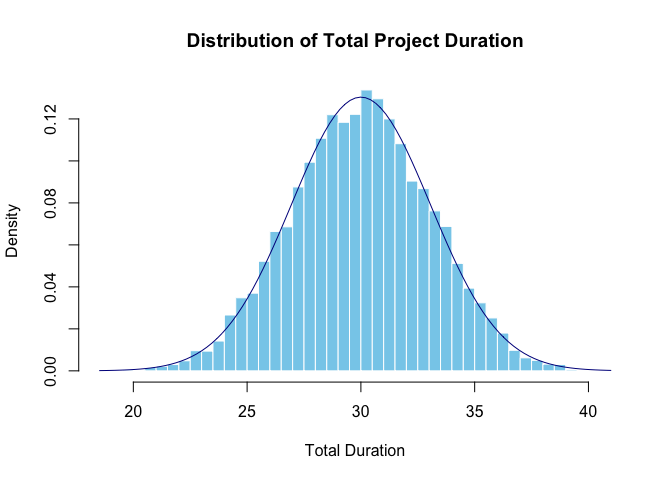
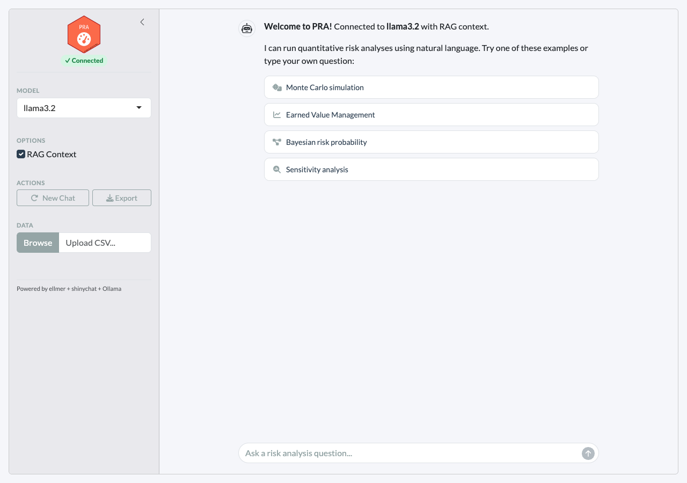

# PRA

## Introduction

Welcome to **PRA**! This project provides a set of tools for performing
Project Risk Analysis (PRA) using various quantitative methods. It is
designed to help project analysts assess and manage risks associated
with project schedules, costs, and performance.

PRA can be used as a traditional R package with direct function calls,
or as an **AI-powered risk analysis agent** with three input modes:

| Input                      | Route                        | When to use                          |
|----------------------------|------------------------------|--------------------------------------|
| `/command`                 | Deterministic tool execution | Reliable, instant results            |
| Natural language with data | LLM selects and calls tools  | Exploratory analysis                 |
| Conceptual question        | RAG knowledge base           | “What is CPI?”, “How does MCS work?” |

## Key Features

### Analytical Methods

- [Second Moment
  Analysis](https://paulgovan.github.io/PRA/articles/SMM.html)
- [Monte Carlo
  Simulation](https://paulgovan.github.io/PRA/articles/MCS.html)
- [Contingency
  Analysis](https://paulgovan.github.io/PRA/articles/MCS.html#contingency)
- [Sensitivity
  Analysis](https://paulgovan.github.io/PRA/articles/MCS.html#sensitivity)
- [Earned Value
  Management](https://paulgovan.github.io/PRA/articles/evm.html)
- [Learning
  Curves](https://paulgovan.github.io/PRA/articles/sigmoidal.html)
- [Bayesian
  Methods](https://paulgovan.github.io/PRA/articles/Bayes.html)

### AI Agent Framework

- **Slash commands** (`/mcs`, `/evm`, `/risk`, …) — deterministic tool
  calls that bypass the LLM for instant, reliable results
- **Natural language interface** — ask risk analysis questions in plain
  English; the agent calls the right tools when you provide numerical
  data
- **RAG-enhanced reasoning** — conceptual questions answered from domain
  knowledge with source citations
- **Fully local** — runs on your machine via
  [Ollama](https://ollama.com), no API keys or cloud services
- **Interactive Shiny app** — chat UI with `/commands`, data upload,
  inline plots, and model settings
- **Evaluation framework** — measure tool-calling accuracy with
  [vitals](https://vitals.tidyverse.org)

See the [Agentic Risk
Analysis](https://paulgovan.github.io/PRA/articles/agent.html) vignette
for details.

## Installation

To install the release version of PRA, use:

``` r
install.packages('PRA')
```

You can install the development version of PRA like so:

``` r
devtools::install_github('paulgovan/PRA')
```

## Usage

### Traditional R Interface

Here is a simple example of how to use the package for a common PRA
task.

First, load the package:

``` r
library(PRA)
```

Suppose you have a simple project with 3 tasks (A, B, and C), but the
duration of each task is uncertain. You can describe the uncertainty of
each task using probability distributions and then run a Monte Carlo
Simulation (MCS) to estimate the overall project duration.

To do so, set the number of simulations and describe probability
distributions for each work package. In this case, run 10,000
simulations with the following distributions:

``` r
num_simulations <- 10000
task_distributions <- list(
  list(type = "normal", mean = 10, sd = 2), # Task A: Normal distribution
  list(type = "triangular", a = 5, b = 10, c = 15), # Task B: Triangular distribution
  list(type = "uniform", min = 8, max = 12) # Task C: Uniform distribution
)
```

Then run the simulation using the `mcs` function and store the results:

``` r
results <- mcs(num_simulations, task_distributions)
```

To visualize the results, you can create a histogram of the total
project duration. You can also overlay a normal distribution curve based
on the mean and standard deviation of the results:

``` r
hist(results$total_distribution,
  freq = FALSE, breaks = 50, main = "Distribution of Total Project Duration",
  xlab = "Total Duration", col = "skyblue", border = "white"
)
curve(dnorm(x, mean = results$total_mean, sd = results$total_sd), add = TRUE, col = "darkblue")
```



This will give you a visual representation of the uncertainty in the
total project duration based on the individual task distributions. On
average, the project is expected to take around 30 time units, but could
take as little as 20 or as much as 40 time units.

### AI Agent Interface

PRA provides three ways to run risk analyses through its agent
framework.

**Slash commands** (deterministic, no LLM required):

``` r
# Monte Carlo simulation
r <- PRA:::execute_command(
  '/mcs tasks=[{"type":"normal","mean":10,"sd":2},{"type":"triangular","a":5,"b":10,"c":15}]'
)
cat(r$result)

# Chain: contingency reserve from the MCS result above
r <- PRA:::execute_command("/contingency phigh=0.95 pbase=0.50")
cat(r$result)

# Full EVM analysis
r <- PRA:::execute_command(
  "/evm bac=500000 schedule=[0.2,0.4,0.6,0.8,1.0] period=3 complete=0.35 costs=[90000,195000,310000]"
)
cat(r$result)

# Bayesian risk probability
r <- PRA:::execute_command("/risk causes=[0.3,0.2] given=[0.8,0.6] not_given=[0.2,0.4]")
cat(r$result)

# List all commands
r <- PRA:::execute_command("/help")
cat(r$result)
```

**Chat interface** (natural language, requires Ollama):

``` r
chat <- pra_chat(model = "llama3.2")

# Numerical data → LLM calls the appropriate tool
chat$chat("Run a Monte Carlo simulation for a 3-task project with
  Task A ~ Normal(10, 2), Task B ~ Triangular(5, 10, 15),
  Task C ~ Uniform(8, 12). Use 10,000 simulations.")

# Conceptual question → answered from RAG knowledge base
chat$chat("What is the difference between SPI and CPI?")
```

**Interactive Shiny app:**

``` r
pra_app()
```

The app supports all three input modes — `/commands` for instant
results, natural language for LLM tool calls, and conceptual questions
for RAG-powered answers:



### Custom Knowledge Base

Extend the agent’s domain knowledge with your own documents:

``` r
store <- build_knowledge_base()
add_documents(store, "path/to/project_docs/")
```

## More Resources

This project was inspired by the book [Data Analysis for Engineering and
Project Risk Managment](https://doi.org/10.1007/978-3-030-14251-3) by
Ivan Damnjanovic and Ken Reinschmidt and is highly recommended.

## Code of Conduct

Please note that the PRA project is released with a [Contributor Code of
Conduct](https://contributor-covenant.org/version/2/1/CODE_OF_CONDUCT.html).
By contributing to this project, you agree to abide by its terms.
