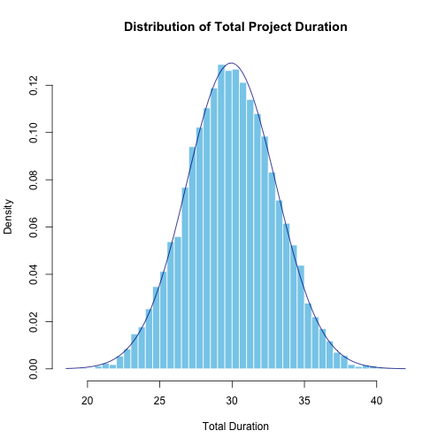

# PRA

## Introduction

Welcome to **PRA**! This project provides a set of tools for performing
Project Risk Analysis (PRA) using various quantitative methods. It is
designed to help project analysts assess and manage risks associated
with project schedules, costs, and performance.

PRA can be used as a traditional R package with direct function calls,
or driven by AI agents: every analytical function is exposed as a tool
over the [Model Context Protocol
(MCP)](https://modelcontextprotocol.io), and the package ships a set of
Agent Skills that tell an agent when and how to call each tool.

## Key Features

### Analytical Methods

- [Second Moment
  Analysis](https://paulgovan.github.io/PRA/book/ch-smm.html)
- [Monte Carlo
  Simulation](https://paulgovan.github.io/PRA/book/ch-mcs.html)
- [Contingency
  Analysis](https://paulgovan.github.io/PRA/book/ch-mcs.html)
- [Sensitivity
  Analysis](https://paulgovan.github.io/PRA/book/ch-sensitivity.html)
- [Earned Value
  Management](https://paulgovan.github.io/PRA/book/ch-evm.html)
- [Learning
  Curves](https://paulgovan.github.io/PRA/book/ch-sigmoidal.html)
- [Design Structure
  Matrices](https://paulgovan.github.io/PRA/book/ch-dsm.html)
- [Probabilistic
  Networks](https://paulgovan.github.io/PRA/book/ch-network.html)
- [Network Portfolio
  Analysis](https://paulgovan.github.io/PRA/book/ch-network2.html)
- [Bayesian Methods](https://paulgovan.github.io/PRA/book/ch-bayes.html)

### AI Agent Integration

- **MCP server** —
  [`pra_mcp_server()`](https://paulgovan.github.io/PRA/reference/pra_mcp_server.md)
  exposes every analytical function as a tool over the [Model Context
  Protocol](https://modelcontextprotocol.io), callable from Claude,
  Claude Code, and other MCP-compatible clients
- **Agent Skills** — bundled `SKILL.md` files (under
  `system.file("skills", package = "PRA")`) document when to use each
  method, which tool to call, the JSON argument format, and how to
  interpret results
- **No embedded model** — all analytical functions run without any AI
  dependency; only the MCP server needs the optional `ellmer`,
  `mcptools`, and `jsonlite` packages

See the [Agentic Risk
Analysis](https://paulgovan.github.io/PRA/book/ch-agent.html) chapter
for details.

## Installation

To install the release version of PRA, use:

``` r

install.packages('PRA')
```

You can install the development version of PRA like so:

``` r

devtools::install_github('paulgovan/PRA')
```

## Usage

### Traditional R Interface

Here is a simple example of how to use the package for a common PRA
task.

First, load the package:

``` r

library(PRA)
```

Suppose you have a simple project with 3 tasks (A, B, and C), but the
duration of each task is uncertain. You can describe the uncertainty of
each task using probability distributions and then run a Monte Carlo
Simulation (MCS) to estimate the overall project duration.

To do so, set the number of simulations and describe probability
distributions for each work package. In this case, run 10,000
simulations with the following distributions:

``` r

num_simulations <- 10000
task_distributions <- list(
  list(type = "normal", mean = 10, sd = 2), # Task A: Normal distribution
  list(type = "triangular", a = 5, b = 10, c = 15), # Task B: Triangular distribution
  list(type = "uniform", min = 8, max = 12) # Task C: Uniform distribution
)
```

Then run the simulation using the `mcs` function and store the results:

``` r

results <- mcs(num_simulations, task_distributions)
```

To visualize the results, you can create a histogram of the total
project duration. You can also overlay a normal distribution curve based
on the mean and standard deviation of the results:

``` r

hist(results$total_distribution,
  freq = FALSE, breaks = 50, main = "Distribution of Total Project Duration",
  xlab = "Total Duration", col = "skyblue", border = "white"
)
curve(dnorm(x, mean = results$total_mean, sd = results$total_sd), add = TRUE, col = "darkblue")
```



This will give you a visual representation of the uncertainty in the
total project duration based on the individual task distributions. On
average, the project is expected to take around 30 time units, but could
take as little as 20 or as much as 40 time units.

### AI Agent Interface

PRA exposes all of its analytical functions to AI agents through an MCP
server. Start it from an R session, or register it with an
MCP-compatible client.

**Register with Claude Code:**

``` sh
claude mcp add -s project pra -- Rscript -e "PRA::pra_mcp_server()"
```

**Register with Claude Desktop** (add to the MCP configuration file):

``` json
{
  "mcpServers": {
    "pra": { "command": "Rscript", "args": ["-e", "PRA::pra_mcp_server()"] }
  }
}
```

Once connected, the agent can call tools such as `mcs_tool`,
`evm_analysis_tool`, `risk_prob_tool`, and `grandparent_dsm_tool` as
native tools. The bundled Agent Skills guide the agent on when and how
to use each one:

``` r

# Locate the installed skill files
list.files(system.file("skills", package = "PRA"))
```

## More Resources

This project was inspired by the book [Data Analysis for Engineering and
Project Risk Managment](https://doi.org/10.1007/978-3-030-14251-3) by
Ivan Damnjanovic and Ken Reinschmidt and is highly recommended.

## Code of Conduct

Please note that the PRA project is released with a [Contributor Code of
Conduct](https://contributor-covenant.org/version/2/1/CODE_OF_CONDUCT.html).
By contributing to this project, you agree to abide by its terms.
